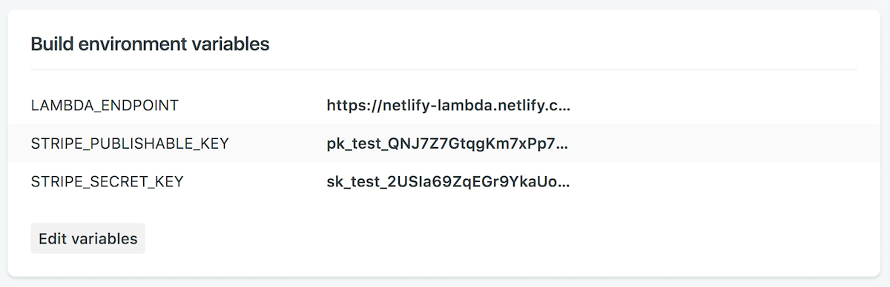

A while back, I wrote my first Lambda function with Firebase. Like every Lambda function tutorial on the web shows you how to do, mine processes a payment via Stripe when someone purchases a license for [TypeIt](https://typeitjs.com), the most versatile JavaScript animated typing utility on the planet. The process was pretty straightforward -- Firebase's CLI, documentation, and support are all great. Even so, I had some reservations about the setup.

First off, TypeIt's site is hosted with Netlify, with which I am madly in love, so development of the function felt... detached. I couldn't easily manage everything within the same repository, and I had to keep tabs on three different services to make this all happen -- Netlify, Firebase, and Stripe.

Second, I'm a cheapskate, and Firebase doesn't have a free tier that permits calls to external services like Stripe. Maybe that's changed, but last I checked, this was the case.

With all that in mind, I nearly peed myself when Netlify's Lambda function service was rolled out, and I immediately dove into migrating my Firebase function to Netlify. It was so fun, I've documented that experience. I'll quickly take you through how to leverage some of the features that make Netlify great, in combination with the power of a Lambda function. Hopefully, you'll get a sense of why a service like this with a provider like this is uniquely awesome.

I'll be using some pretty bare bones here, but you can implement the function with any type of static application you want -- Jekyll, Gatsby, whatever. _Just make sure you have a static site you're able to host with Netlify, and that it uses webpack (we'll be using its `DefinePlugin`, specifically)._ I'm starting with an `index.html` file, some CSS, JavaScript, and some tools to pull it all together. You can see the full setup [here](https://github.com/alexmacarthur/netlify-function-example). You'll also need a Stripe account, which you can get for free [here](https://dashboard.stripe.com/register).

Letz do dis.

## Setting Up Our Function
I'm going to assume you have a basic JAMStack project already set up & ready to go, including a `package.json` file. After that groundwork is laid, walk through these steps:

**Create directories to store your Lambda code.** One of these will contain your pre-compiled source code, and the other will be where Netlify puts the production-ready code. Locally, we'll only be serving out of the `lambda-src` directory, and so creating that `lambda` directory is technically unnecessary (later, when we deploy, Netlify will create that directory automatically), but we'll go ahead and do it here for better clarity in what's going on.

`mkdir lambda-src lambda`

**Install the Netlify Lambda CLI.** This will give us the ability to develop & test the function locally before deploying it to Netlify.

`npm install netlify-lambda -D`

**Create a `netlify.toml` file,** which will contain the required configuration information for our function's deployment.

`touch netlify.toml`

The `netlify.toml` file is responsible for defining things like build commands, our publish directory, environment variables, and most notably for what we're doing here, where our Lambda function directory will be. It's worth mentioning that you can also set this directory in the admin, but that's slightly less cool.

After defining that directory as well as a couple other nice-to-haves, we're left with this, which sits in the root of our project. For more information on how this file works and its capabilities, [read the documentation](https://www.netlify.com/docs/netlify-toml-reference/);

```
# netlify.toml

[build]
  command = "npm run build"
  publish = "src"
  functions = "lambda"
```

Translation: On build, Netlify will build our stuff using the specified build command, serve our site from the `src` directory, and serve our function from the `lambda` directory.

**Next, let's set up some actions in our `package.json` to run our code locally and build it for production.**

We'll configure everything to run a small development server _and_ a Lambda function server at the same time. To do this, we'll use the `concurrently` package, which will need to be installed as well:

`npm install concurrently -D`

Following that, our `scripts` will look something like this:

```json
"scripts": {
  "lambda-serve": "netlify-lambda serve lambda-src",
  "lambda-build": "netlify-lambda build lambda-src",
  "build": "NODE_ENV=production webpack && npm run lambda-build",
  "dev": "NODE_ENV=development concurrently \"webpack-dev-server --content-base src/\" \"npm run lambda-serve\"",
}
```

When `npm run dev` is fired, we'll have a working development server for loading our static page, as well as a local endpoint for our function. Notice that we're not passing any function-specific information to these commands -- `netlify-lambda` will pull all that it needs from our `netlify.toml` file.

**After that, let's define some variables we'll need.** Specifically, I'm talking about Stripe publishable and secret keys, which are 1) pieces of sensitive information we don't want to commit to our repository, and 2) not the same between our development and production environments.

It's possible to define things like this in a `netlify.toml` file, but because of those sensitivity concerns, we're going to set these values in Netlify's admin under the "Build & deploy" section. This will prevent us from having to commit them to version control. You can get these keys from your Stripe dashboard.



You'll notice I also threw our `LAMBDA_ENDPOINT` in there too. More on that in a second.

To access these Stripe keys locally, we'll be using the [dotenv](https://github.com/motdotla/dotenv) (thanks to [Phil Hawksworth](https://www.hawksworx.com/) for that tip!). What it does is pretty simple: when we reference an environment variable that isn't defined in Node's `process.env` object (like when we're working locally), fill it in by referring to a `.env` file we'll have in our project. This file _won't_ be committed to the repository, and will only contain test keys. That said, put this file into your `.gitignore` file to prevent it from ever being pushed up. This is... _key_.

```
echo ".env" >> .gitignore
```

Install the package and create that `.env` file.

```
npm install dotenv -D
touch .env
```

In that file, go ahead and fill the Stripe variables with test keys, but ignore the `LAMBDA_ENDPOINT` variable until the next section.

```
STRIPE_PUBLISHABLE_KEY="XXXXXX"
STRIPE_SECRET_KEY="XXXXXX"
LAMBDA_ENDPOINT="http://localhost:9000/purchase"
```

### Actually Writing Some Lambda Code

**Create a `purchase.js` file inside `lambda-src`.** When we're ready to post to our function, the name of the file inside of the `lambda` directory will become our endpoint. For us, when using `netlify-lambda` locally, this will be `http://localhost:9000/purchase`. After we deploy, you'll use your site's URL: `https://your-site-name.netlify.com/.netlify/functions/purchase`. You saw me already set this for each of our enviornments using the `LAMBDA_ENDPOINT` variable in the Netlify admin and our local `.env` file.

Kick off our function's code by initializing `dotenv` and authenticating with Stripe. This will load any variables in our `.env` file into `process.env`, unless those variables are already set. Because of this, code is flexible regardless of our environment.

```js
// purchase.js

require('dotenv').config();

const stripe = require('stripe')(process.env.STRIPE_SECRET_KEY);
```

**Now, let's set appropriate headers.** We'll want to make sure we're allowing access to our function via AJAX, and also ensure that we can pass data successfully. For now, I'm just going to open it up to requests from any domain, but you'll want to change that when you deploy. Because I want to later leverage JavaScript's enhanced object literals, I also saved a default status code:

```js
// purchase.js

require('dotenv').config();

const stripe = require('stripe')(process.env.STRIPE_SECRET_KEY);

const statusCode = 200;
const headers = {
  "Access-Control-Allow-Origin" : "*",
  "Access-Control-Allow-Headers": "Content-Type"
};
```

**Next up, create a Lambda function handler.** This is where the magic happens. Just to make sure things are working as they should, I'm gonna immediately return a response with a unique message in the body. If you've built Lambda functions with AWS and this looks vaguely familiar, there's a reason for that. [Netlify deploys your function to AWS](https://functions-beta--www.netlify.com/docs/lambda-functions/).

```js
// purchase.js

exports.handler = async function(event) {
  return {
    statusCode,
    headers,
    body: 'Let there be light!'
  };
}
```

Quick thing: I'm using an `async` function for my Lambda. This is because we'll later be doing some asynchronous work, and I prefer the cleaner syntax. But if you prefer to write something a little more verbose, you'll need to return a `callback` method to return your response, which would look like this:

```js
// purchase.js

exports.handler = function(event, context, callback) {
  return callback(null, {
    statusCode,
    headers,
    body: 'Let there be light!'
  });
}
```

Now, if we run `npm run lambda-serve` and head to `http://localhost:9000/purchase`, we should see 'Let there be light!' in the browser. Good sign!

**Add a small check to make sure we're only dealing with POST requests.** For the longest time, I was having an issue correctly parsing data from a request, only to discover it was because it wasn't the data from my POST request I was trying to parse -- it was from a preflight OPTIONS request that comes in to ensure the CORS protocol is understood. To prevent this from happening, use this:

```js
// purchase.js

exports.handler = async function(event) {
  if (event.httpMethod !== "POST") {
    return {
      statusCode: 200, // <-- Important!
      headers,
      body: "This was not a POST request!"
    };
  }
}
```

Here, it's especially important to make sure you're returning a valid `200` status code. If you don't, that preflight request will fail, and a CORS-related error will be thrown.

**Now we can reliably parse the body and make sure we have everything we need.** If we don't, execute the callback with a message of some sort.

```js
// purchase.js

exports.handler = async function(event) {

  // We only care to do anything if this is our POST request.
  if (event.httpMethod !== "POST") {
    return {
      statusCode,
      headers,
      body: "This was not a POST request!"
    };
  }

  // Parse the body contents into an object.
  const data = JSON.parse(event.body);

  // Make sure we have all required data. Otherwise, get outta here.
  if (!data.token || !data.amount || !data.idempotency_key) {
    const message = "Required information is missing!";

    console.error(message);

    return {
      statusCode,
      headers,
      body: JSON.stringify({
        status: "failed",
        message
      })
    };
  }
};
```

While we're here, let's break down this `data.token`, `data.amount`, and `data.idempotency_key` stuff for which we're checking.

`token`: This will be the unique payment token be generated by our checkout form on the front end. In it, the user's email address is also included, which comes in handy to trigger email receipts.

`amount`: This will be the price of the widget, measured in cents. So, `1000` is actually `$10.00`.

`idempotency_key`: This is a good idea to pass to better [prevent the same operation from being accidentally performed twice](https://stripe.com/docs/api?lang=curl#idempotent_requests). It doesn't necessarily matter what that value actually is -- just that it's unique.

**If the body has everything we require, pass it to Stripe to create a charge.** After we get a response back, we're returning the status of that charge back to the browser. Feel free to elaborate on this as you see fit. Create customers, trigger emails following a successful charge, whatever you like. The point is we create a charge and immediately let the browser know if it was successful or not.

```js
// purchase.js

let charge;

try {
  charge = await stripe.charges.create(
    {
      currency: "usd",
      amount: data.amount,
      source: data.token.id,
      receipt_email: data.token.email,
      description: `charge for a widget`
    },
    {
      idempotency_key: data.idempotency_key
    }
  );
} catch (e) {
  let message = e.message;

  console.error(message);

  return {
    statusCode: 424,
    headers,
    body: JSON.stringify({
      status: "failed",
      message
    })
  };
}

const status = (charge === null || charge.status !== "succeeded") ? "failed" : charge.status;

return {
  statusCode,
  headers,
  body: JSON.stringify({
    status,
    message: "Charge successfully created!"
  })
};
```

## Setting Up the Front End

At this point, we're ready to start work on the front end, which will consist of generating a Stripe token and then posting it via AJAX to our Lambda function. To keep it simple, we're going to be using Stripe Checkout to do this. Basically, just drop it in and you're ready to go.

**Add the Stripe Checkout script to the bottom of the body in your `index.html` file, and add a button that'll be used to open the checkout form.**

```html
<button>
  Click to Buy! <strong>$10</strong>
</button>
```

```js
<script src="https://checkout.stripe.com/checkout.js"></script>
```

**Configure webpack to make our environment variables available on the front end.** Much like we did before, we'll initialize `dotenv` so we can access environment variables locally. At the top of our `webpack.config.js` file, let's add this:

```js
// front-end.js

require('dotenv').config();

const webpack = require('webpack');

module.exports = {
  // webpack configuration...
}
```

Same as before, we're letting `dotenv` fill in the `process.env` gaps if a particular variable isn't already defined. Below that, we expose those variables to our JavaScript using webpack's `DefinePlugin`.

```js
// webpack.config.js

module.exports = {
  entry: './src/front-end.js',
  output: {
    path: __dirname + '/src',
    filename: 'bundle.js'
  },
  plugins: [
    new webpack.DefinePlugin({
      LAMBDA_ENDPOINT: JSON.stringify(process.env.LAMBDA_ENDPOINT),
      STRIPE_PUBLISHABLE_KEY: JSON.stringify(process.env.STRIPE_PUBLISHABLE_KEY),
    })
  ]
}
```

**Now, let's create a Stripe Checkout handler in our front-end.js file, and include that bundled `bundle.js` file at the bottom of `index.html`.**

```js
// front-end.js

const handler = StripeCheckout.configure({
  key: STRIPE_PUBLISHABLE_KEY,
  image: "https://stripe.com/img/documentation/checkout/marketplace.png",
  locale: "auto",
  token: token => {
    // We'll fill this out in a second.
  }
});

```

**Let's open our checkout form when someone clicks the button.**

```js
// front-end.js

// Stripe handles pricing in cents, so this is actually $10.00.
const amount = 1000;

document.querySelector("button").addEventListener("click", function() {
  handler.open({
    amount,
    name: "Test Shop",
    description: "A Fantastic New Widget"
  });
});
```

At this point, when a user clicks the button on our page, a beautiful Stripe checkout form should pop up, ready to collect that user's payment information. Once that form is submitted, we send that information to our function.

**Send the generated token to our Lambda function via AJAX.** Add this to your `front-end.js` file, right after our token is generated. I'm using the browser's [Fetch API](https://developer.mozilla.org/en-US/docs/Web/API/Fetch_API), but really doesn't matter what you choose.

```js
// front-end.js

const handler = StripeCheckout.configure({
  // -- Other stuff we've already gone through.
  token: async (token) => {
    let response, data;

    try {
      response = await fetch(LAMBDA_ENDPOINT, {
        method: "POST",
        body: JSON.stringify({
          token,
          amount,
          idempotency_key: uuid()
        }),
        headers: new Headers({
          "Content-Type": "application/json"
        })
      });

      data = await response.json();
    } catch (error) {
      console.error(error.message);
      return;
    }
  };
```

To generate our `idempotency_key`, I'm using the [uuid](https://www.npmjs.com/package/uuid) package. It's really unique (lol). Run `npm install uuid -D` and import it at the top of your file.

```js
// front-end.js

import uuid from 'uuid/v4';
```

Great, we've thrown a bunch of code together. Now...

**Let's spin it up locally!** If you recall the actions we set up, using `npm run dev` will spin up a webpack dev server, as well as trigger `netlify-lambda` to serve our function. Run that command, and our application should be available at `http://localhost:8080`. Click the button, enter your payment information (use `4242424242424242` for the card number in development mode), and you *should* see a successful response in the console. Of course, this is web development we're doing here, where very little goes right the first time, so have some patience as you work out any issues you have standing it up.

## Time to Deploy!

**Let's get this sucka live.** Put all this into a repository, log into your Netlify account, hook up the tubes, and set your environment variables, if you haven't already. Because of our `netlify.toml` file, Netlify should already know from where to serve your function. Once that's done, you should see our `purchase.js` function listed on the 'Functions' page, where logging will be available to view, should you need it. When you're debugging, you can dump logs into this window by using `console.log()`.

## Resources

If you want to dig into this particular example more yourself, check out [the repo on Github](https://github.com/alexmacarthur/netlify-function-example). There, I have a simple working demo that actually submits a fake payment to Stripe. If you wish that payment to be not fake, we can have that arranged.

When you're ready to explore Lambda functions with Netlify yourself, [dig in here](https://www.netlify.com/docs/functions/).

## Make Sense?

I hope this process was generally easy to follow without a whole lot of frustration. If you do have any questions, corrections, or tips for improving it, reach out!
