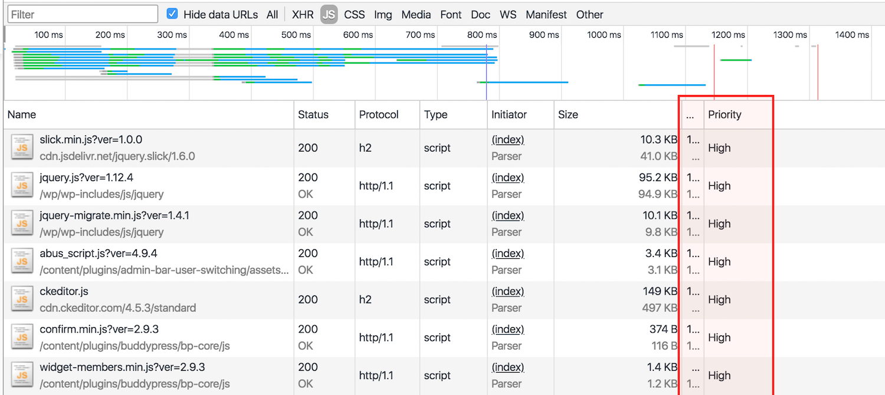

Squeezing every last drop of performance out of your website on any platform is an always-changing, never-ending, often addictive battle.

Among the several tactics you can employ in this fight, leveraging [resource hints](https://www.w3.org/TR/resource-hints) is a modern approach that can yield some significant ROI -- with preloading is a particularly impactful place to start. [It's a topic worth learning about in more depth yourself](https://www.smashingmagazine.com/2016/02/preload-what-is-it-good-for/), but in short, preloading directs a browser to asynchronously load an asset as soon as possible in the background, so it's ready to be used when the page calls for it. While the _amount_ of data being loaded by your page won't change, the start-to-end process of it all will go more quickly, impacting metrics like [TTI](https://web.dev/interactive/).

Preloading is most useful for fetching resources that are discovered late within the page life cycle -- things like fonts or images that are referenced from within a stylesheet, or other assets that are requested via JavaScript. But it's also been used to prioritize top-level assets on a page, like your main JavaScript files:

```html
<html>
	<head>
		<link rel="preload" href="https://my-script.js" as="script" />
	</head>
	<body>
		<!-- a bunch o' content -->
		<script src="https://my-script.js"></script>
	</body>
</html>
```

When a page like this loads, the browser is told to download the referenced asset at high priority, beating out the priority placed on other resources that might have been requested.

## What This Doesn't Mean

To be fair, a setup like this won't _guarantee_ you great gains in raw performance, and that's because the browser's already _really_ good at this sort of thing. For the past several years, browsers have implement a practice called "speculative scanning," or "preload scanning." Per this process, as the browser is building the DOM for the page, it will parse the HTML document for resources it'll eventually need (JavaScript, CSS, etc.), and [begin downloading those in the background](https://hacks.mozilla.org/2017/09/building-the-dom-faster-speculative-parsing-async-defer-and-preload/). You get this for free, right out of the box.

But what this process _won't_ do for you is tell the browser which assets it finds are _most_ important (it'll default to its own logic for that -- usually by placement on the page). In the WordPress space especially, this is where the `preload` hint is especially handy. Depending on the site, a WordPress application often enqueues several different JavaScript, CSS, and image resources all at once, with a lot of those having low priority on certain pages, and higher priority on others. Indiciating which ones are most crucial can give the browser a leg up when your site loads.

## Automate JavaScript Preloading in WordPress

In WordPress, it's easy enough to manually spit out a `link ref="preload"` tag for each file you'd like to preload, but it's kind of a pain to set up if you're managing a site with a lot of different scripts being loaded throughout the frame of the page. You want this automated, and you want that automation to be smart about which scripts are chosen to be preloaded.

The most straightforward solution to this is to **loop over your registered scripts preload them in the header.** This can be achieved by simply running the following few lines of code in your application. You _could_ drop them in your theme's `functions.php` file, but don't. Instead, just [make a really simple plugin](https://macarthur.me/posts/creating-the-simplest-wordpress-plugin). It's almost always a better option.

```php
add_action('wp_head', function () {
  global $wp_scripts;

  foreach ($wp_scripts->queue as $handle) {
    $script = $wp_scripts->registered[$handle];

    //-- If version is set, append to end of source.
    $source = $script->src . ($script->ver ? "?ver={$script->ver}" : "");

    //-- Spit out the tag.
    echo "<link rel='preload' href='{$source}' as='script'/>\n";
  }
}, 1);
```

Here's what's going on: On the `wp_head` hook (which fires after our scripts have been enqueued), we're looping through our registered scripts and printing out a `link` tag in our `head` for each resource. In the end, we've given our registered JavaScript resources priority over every other asset that the browser has otherwise discovered for download.

Two notes about this setup:

**1. We're hooking into `wp_head` with an early priority to spit out our `link` tags.** We're choosing this hook because it fires after our scripts have been enqueued, and it allows us to get as close to the top of the page as possible. The priority of `1` means it'll fire early on -- before most other stuff gets printed in the head. The `wp_print_scripts` or `wp_print_styles` hooks would also work just fine -- it'd just mean that our hints are generated a little farther down on the page.

**2. We're making sure the URLs of these assets match _exactly_, including the version.** You'll notice that if a version isn't set on an asset we're looping over, not even the `?` is attached to our source URL. That's because if the `href` in your `link` tag doesn't match the `src` attribute of your `script` tag, the browser will think these are two different resources, and you'll have gained nothing.

**3. We're preloading even the scripts that are enqueued in the `<head>`.** It might seem counterintuitive, since the browser should give them relatively high priority due to where they're located. But it's possible that other scripts may compete with these, and we want to deliberately give _ours_ the highest priority, regardless of where the actual `<script>` tags are placed.

## Think About Scoping

With this setup, we're preloading every enqueued script out of the box, and as a result, it's possible that we're setting priority to scripts of less concern to us. So, for your specific use case, consider introducing some logic that would make this a little more intentional. For example, if you want to explicitly prioiritze your theme's scripts, you might only generate the hint when the script's path is found within your theme's directory.

```php

add_action('wp_head', function () {
  global $wp_scripts;

  foreach ($wp_scripts->queue as $handle) {
    $script = $wp_scripts->registered[$handle];

    // This script's doesn't belong in my theme; don't preload.
    if (strpos($script->src, "/themes/mytheme/") === false) {
      continue;
    }

    if (isset($script->extra['group']) && $script->extra['group'] === 1) {
      $source = $script->src . ($script->ver ? "?ver={$script->ver}" : "");
      echo "<link rel='preload' href='{$source}' as='script'/>\n";
    }
  }
}, 1);
```

## Verify It's Working

Open the source on your page. You should see tags for each one of your footer-enqueued JavaScript files that look like this in your header:

```html
<link rel='preload' href='https://whatever-source.js?v=123' as='script'/>
```

Now, look for the `script` tag in your footer that loads each respective file, and verify that the sources match exactly.

```html
<script src='https://whatever-source.js?v=123'></script>
```

Next, if you're using Chrome, go into your developer tools, select the "Network" tab and refresh your page. Filter by JS files only, and you should see something like this:



Each of those files at the top should have a priority of "High" in the order you preloaded them.

## Measure Your Performance Results!

Obviously, all of this is pointless unless there are measurable performance gains that come out of it. When I was testing a specific WordPress application with a great deal of plugin-enqueued scripts, I saw some pretty encouraging numbers. By nature of the a local development environment, these results varied, but were consistently positive.

Lighthouse Performance Results:

---

**Overall Score:** 2-5 point improvement

**First Meaningful Paint:** As high as ~20% improvement

**First Interactive:** As high as ~15% improvement

**Perceptual Speed Index:** As high as ~20% improvement

---

This is for a very specific JavaScript-heavy use case, running on my local machine using Chrome's built-in Lighthouse auditing tool. I did some quick testing with a less script-heavy marketing site, and those improvements fell down to the 3-5% range. Regardless of the actual numbers, it's hard to deny those are some significant improvements. And for such a quick, low-impact win, you'd be a fool to turn those savings down.

Did you see similar improvements? Share your results when you measure them!

## This _Should_ Be Safe, but Test Thoroughly

All this snippet is doing is preloading scripts that are already being loaded on your page. It doesn't rearrange load or execution order, mess with `async` or `defer`, or anything else. So, like leveraging any other resource hints responsibly, it **should** be relatively safe. Even so, be a good developer and test before deploying to production.

Hope this tip leads you to some notable performance gains! As always, shoot any feedback, corrections, or improvements my way!
