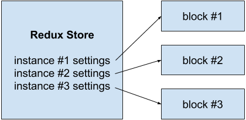

I'm writing a Gutenberg block for [TypeIt](https://typeitjs.com) that'll allow content creators to easily drop typewriter effects into WordPress. The Gutenberg infrastructure is heavily rooted in the React ecosystem, so building a block feels very much like building a React application.

One piece of this ecosystem that's new to me, however, is [Redux](https://redux.js.org/), and soon after I dove into it, I ran into a problem that had my head tilting for quite some time -- enough time to warrant writing it down in case I ever need to explain it to myself again.

## The Problem

The short version is that **I seemingly couldn't update local state inside a Redux store listener housed within that component.** And in my particular setup, an infinite loop was resulting. I was dumbfounded.

## The Context

In my code, I have a global Redux store that's responsible for holding the [base options](https://typeitjs.com/docs#options) for each TypeIt block on a page (why they're managed separately like this is another conversation). Whenever a block is saved, I want to pull down that block's options from the shared store and save them with the block itself, rather than storing them somewhere else altogether. Here is my professional artistic attempt to illustrate this arrangement:



**I attempted to solve this by updating local block state whenever my global store changed.** To pull it off, in my block's component, I used Redux's `subscribe` method to listen for any global store changes. When they occurred, I checked if the options for my specific block have changed, and if they did, I updated my block's `attributes` (the `prop` used in a Gutenberg block to save and manage block data).

That looked something like this (a bit stripped down for brevity):

```javascript
const { useEffect } = wp.element;
const { subscribe } = wp.data;

registerBlockType('wp-typeit/block', {
  // ...
  edit: ({ attributes, setAttributes }) => {
    // ...
    useEffect(() => {
      subscribe(() => {
        let baseSettings = wp.data.select('wp-typeit/store').getSettings()[instanceId]

        if (JSON.stringify(baseSettings) !== JSON.stringify(attributes.settings)) {
          setAttributes({ settings: baseSettings });
        }
      }
    }, []); // <-- Only set up listener on `mount`.
  }
}
```

This _looked_ pretty safe. But when a global store change occurred, an infinite loop was set off within the component. I soon realized that the `setAttributes` method provided by Gutenberg triggered _another_ store change (I don't yet know why). Unexpected, but it still shouldn't be a problem. After all, the next time the listener fires, my global settings _should_ exactly match my local attributes, preventing the `setAttributes` method from being called again.

But that was apparently incorrect. As it turned out, within that `subscribe` listener, _my local state wasnt't getting updated at all._ And so every time the listener fired, that equality check would fail every time, over and over again. Infinite loop.

## Remember, This Is React

It took a bit, but the solution to this problem arose after remembering how React handles updates to its state. Every time a component's state (including props) is changed, that component is re-rendered, and it's only _after_ that rerender when the updated state (including props) is available.

But my `subscribe` listener wasn't respecting that. It was being activated _once_ after the component mounted, and so it was only aware of the version of the props it had at that specific time. I could call `setAttributes` all I wanted, but that specific listener instance would behave as if nothing happened at all.


```javascript
useEffect(() => {
  subscribe(() => {
    // Listener is created ONCE, and never aware of future state updates.
  }
}, []);
```

## The Solution: Clean Up Store Listeners

In order to perform future store comparisons after my local state was updated, **I needed to throw away my `subscribe` listener every time a local state change occurred**. With my specific circumstances, that meant a few tweaks:

1. **Extract the `unsubscribe` method** returned [when a subscribe listener is created](https://redux.js.org/api/store#subscribelistener).
2. **Unsubscribe immediately before the `setAttributes` method fires.** Since `setAttributes` triggers a global store change, this unplugs the listener to prevent it from firing before the local state is technically updated.
1. **Instead of setting up a single listener on `mount`, do so _every time_ the block is updated.** To avoid listeners becoming stacked upon listeners, I'm using the [cleanup mechanism](https://reactjs.org/docs/hooks-effect.html#example-using-hooks-1) built into the `useEffect` hook by returning from the hook with an `unsubscribe()` method call. Even though I'm already unsubscribing every time I call `setAttributes`, this will cover my butt any time a different state change occurs, totally unrelated to these settings. The objective is to never have more than one store listener active in the component at once, and this helps guarantee that.

In all, those changes look like this:

```diff
const { useEffect } = wp.element;
const { subscribe } = wp.data;

registerBlockType('wp-typeit/block', {
  // ...
  edit: ({ attributes, setAttributes}) => {
    useEffect(() => {
      // ...
-     subscribe(() => {
+     const unsubscribe = subscribe(() => {
        let baseSettings = wp.data.select('wp-typeit/store').getSettings()[instanceId]

        if (JSON.stringify(baseSettings) !== JSON.stringify(attributes.settings)) {
+         unsubscribe();
          setAttributes({ settings: baseSettings });
        }
      }

+      return () => {
+        unsubscribe(); <!-- Destroy listener after every state change.
+      }
-    }, []);
+    }); // <!-- Activate new listener after every state change.
  }
}
```

## Takeaway: Understand the React Lifecycle

While this particular problem is highly specific to WordPress/Gutenberg, it all illustrates how important it is to have a solid understanding of the React lifecycle and the gotchas that it makes possible by nature. In fact, it's probably a good practice to _start_ troubleshooting bugs like this by rubber ducking the events leading up to and following the undesired behavior that's occurring. If it's anything like the challege I've shared here, you'll walk away with a better understanding of how React fundamentally works, as well as confirmation that you're not actually going insane.
