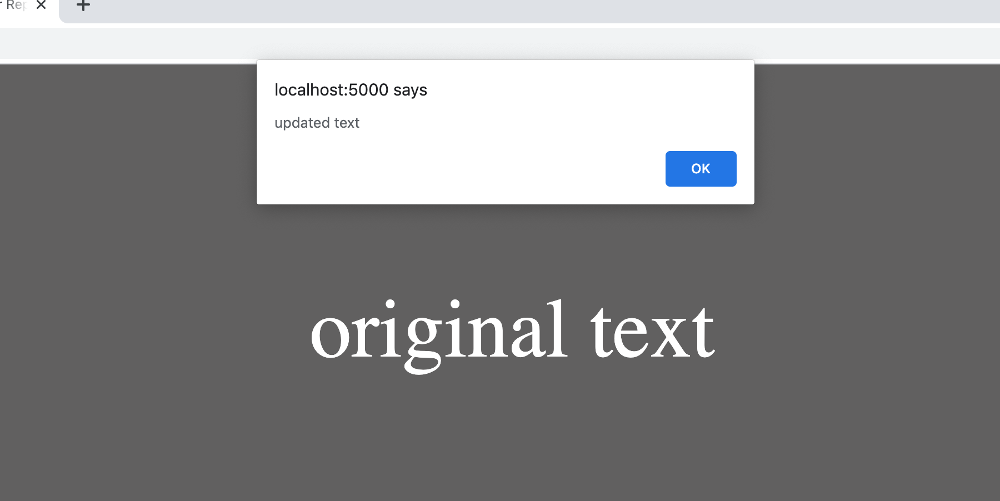
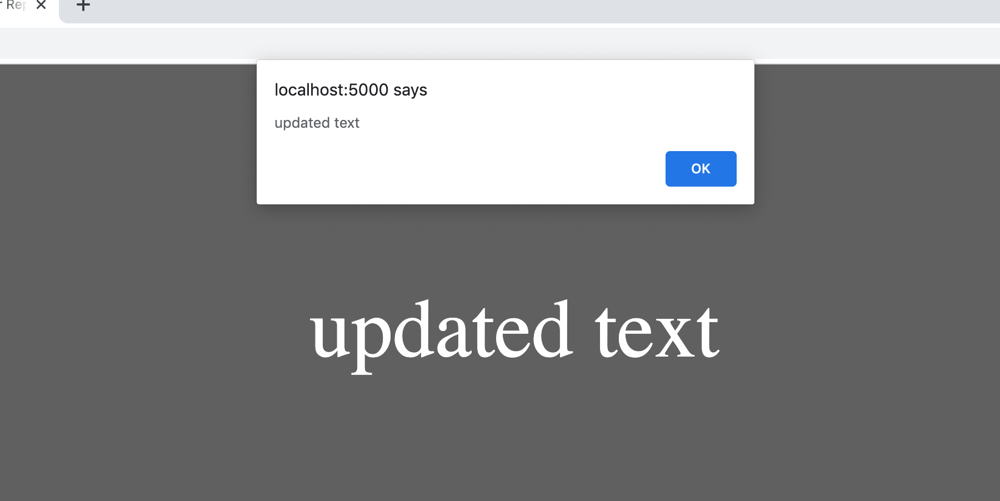

Imagine we have some JavaScript on a page that updates an element's contents and immediately logs those contents out:

``` html
<span id="element">
  original text
</span>

<script>
  document.getElementById('element').innerHTML = "updated text";
  console.log(element.innerHTML);
</script>
```

After loading the page, you'd correctly expect that "updated text" will be displayed on the screen. And when it's exposed via that `console.log()`, you'll see the same value there too.

The fact that `console.log()` yields this result isn't surprising because a DOM update is a *synchronous* event. When the properties of the DOM object are modified, that change is thrown onto the call stack, and no proceeding event can execute until the stack is empty again. This is how JavaScript's event loop does it's thing — first in, first out — even though many of those events simply kick off asynchronous work handled by browser APIs (like `setTimeout()`, for example).

## Same Thread; Different Pace

Despite it being synchronous, before a DOM change can be made visible _on the screen_, [several processes](https://developers.google.com/web/fundamentals/performance/critical-rendering-path/render-tree-construction#tldr) occur: the render tree is updated, the layout of the page is reflowed, and the result is finally painted. These processes all operate on the same thread as JavaScript's event loop, _but at a different pace._ Consider this shoddy illustration I put together:


<em>the event loop vs. the repaint cycle</em>

The **horizontal bar** represents the browser's main thread — everything operates here, unless you're doing something like leveraging Web Workers (and [you probably should be](https://macarthur.me/posts/use-web-workers-for-your-event-listeners)).

The **smaller vertical bars** represent the execution of JavaScript's event loop. It's fast, firing as quickly as it can execute items on the call stack, often communicating with browser APIs along the way.

The **thicker vertical bars** represent how frequently the browser repaints the screen. That rate usually [sits at around 60 frames/second](https://developers.google.com/web/fundamentals/performance/rendering), or about once every ~16. 66ms. Every time it occurs, it'll take all the DOM changes made between the current paint and the previous paint and make them visible to the user.

Most of the time, the relationship between the event loop and the repaint cycle is inconsequential to our work and virtually irrelevant to the user's experience. But sometimes, circumstances arise when this whole DOM-to-screen process can make us wonder if modifying the DOM really is a synchronous job at all.

## Make a DOM Update Look Asynchronous w/ `alert()`

Let's explore one of these circumstances. To do so, I'm using a simple local Node server with a bit of HTML. You're welcome to follow along with the changes we'll be making by [cloning the repo for yourself](https://github.com/alexmacarthur/dom-updates-and-browser-repaints) and uncommenting each example as needed. (I considered using something like [CodeSandbox](https://codesandbox.io/) for these examples, but I needed an environment as pure & predictable as possible. Platforms that serve a site through an embedded iframe couldn't quite provide that.)

This time around, instead of logging out the modified DOM value, let's expose it with an `alert()`. When that action is thrown onto the call stack, it'll freeze the main thread, including any outstanding repaints.

``` js
const element = document.getElementById('element');
element.innerHTML = "updated text";
alert(element.innerHTML);
```

After refreshing the page this time, you'll see the "updated text" correctly revealed in the alert box, indicating that the DOM update itself _really was_ synchronous. But if you look at what's actually rendered to the screen, it's probably not what you'd expect:



The modification to the DOM object is complete, **but the respective *repaint* has not yet been able to occur** (remember — the event loop is turning over much faster than the browser's refresh rate). The instant that the `alert()` is dismissed, repaints are allowed to proceed, and our text is updated.

## Making Things Unfold More Predictably

Again, this quirk is unlikely to trip-up any real-world work, but since we're here anyway, let's toy with making things behave a little more predictably. Say we wanted the `alert()` to fire _only after the DOM change has been rendered to the screen._ To do so, we have a couple of options, one of which is hackier than the other.

### Option #1: Delay the `alert()`.

By wrapping our `alert()` in a `setTimeout()`, we can wait long enough for any outstanding repaints to occur, and successfully fire it after the updated text has been rendered.

``` jsx
const element = document.getElementById('element');
element.innerHTML = "updated text";

setTimeout(() => {
	alert(element.innerHTML);
}, 20); // <-- arbitrary number greater than refresh rate
```

This "works," but it isn't the most elegant solution, mainly because we're making an educated guess as to when the repaint cycle will have turned over. We don't want to wait too long, causing an unnecessary delay for the `alert()`. But if we cut it close and the timeout fires sooner than that delay, we're not guaranteed to see the correct text on the screen when it's frozen, because the browser didn't have a chance to paint outstanding DOM changes.

We can illustrate this by setting the timeout's delay to something less than the refresh rate and reload the page a few times. Much of the time, the text will still correctly render. But sooner or later, the rendered text will *not* have updated like we want.

``` jsx
const element = document.getElementById('element');
element.innerHTML = "updated text";

setTimeout(() => {
	alert(element.innerHTML);
}, 5); // <-- risky, since the delay is less than the browser's refresh rate
```

Since we can't undoubtedly predict the refresh rate of the browser (especially considering the range of things that could impact the main thread's throughput overall), this option is pretty far under the bar of "ideal." Thankfully, the browser offers a built-in API for navigating the repaint cycle by design, providing us with a much friendlier option.

### Option #2: Fire After Next Repaint

The browser's `requestAnimationFrame` API lets us [fire a callback before the browser's next repaint](https://developer.mozilla.org/en-US/docs/Web/API/window/requestAnimationFrame), allowing us to avoid any guessing games in our objective. To use it for our purposes, it's tempting to fire our `alert()` in one of its callbacks and call it good:

``` jsx
const element = document.getElementById("element");
element.innerHTML = "updated text";

requestAnimationFrame(() => {
	alert(element.innerHTML);
});
```

**But that won't work.** Firing *before* the next repaint is pointless. Instead, we want it to happen *after*, since this is when the DOM update will have been painted to the screen. To accomplish this, we just need to nest things a bit:

``` jsx
const element = document.getElementById('element');
element.innerHTML = "updated text";

requestAnimationFrame(() => {
	// fires before next repaint

	requestAnimationFrame(() => {
		// fires before the _next_ next repaint
		// ...which is effectively _after_ the next repaint

		alert(element.innerHTML);
	});
});
```

With that, we're good to go! The `alert()` will only after outstanding DOM changes have been painted to the screen. As a result, what we see in the `alert()` and what's rendered on the page will consistently be the same:



## The Broader Implications

Experimenting like this is fun in & of itself, but it should also impact the way you think more broadly about the relationship between the DOM and the browser's rendering engine, especially as it all impacts the performance of your code.

There's more going than what you might think when a DOM attribute is modified, and when the black box of a browser starts to become a little more translucent, it can set you up to understand & tackle tangential problems that impact user experience more apparently, like how certain changes to the DOM trigger synchronous style & layout updates (Paul Irish has [a good starter resource](https://gist.github.com/paulirish/5d52fb081b3570c81e3a) on this).

But even if you don't go down a road like that, hopefully this gets you thinking about the the inner-workings of the browser more than before, if for no other reason than to appreciate the tool a little more for all that it does.

_**Shoutout!** All of this was inspired by [a tweet](https://twitter.com/rauschma/status/1288868746682081285?s=19) from [Dr. Axel Rauschmayer](https://dr-axel.de/), in which he asked for a safe way to fire an `alert()` only after a DOM change is visible on the screen. That question and the following discussion got my gears turning to fully understand why the best solution works the way it does._
