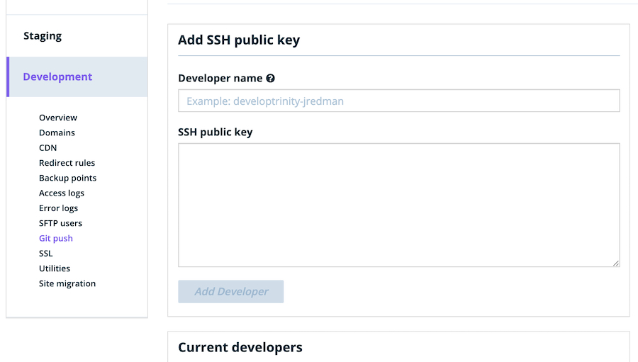
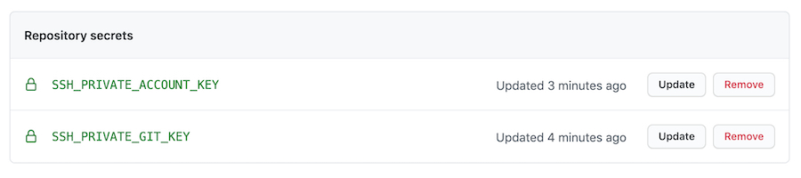

It's difficult to overstate the value of GitHub Actions in automating tasks we previously had to perform manually -- deploying WordPress sites included. Recently, I was tasked with setting up a WordPress repository to automatically deploy to a [WP Engine](https://wpengine.com/) environment whenever a commit is made to a particular branch. There exists a variety of actions in the marketplace for taking care of this automatically. For example, [this one](https://github.com/jovrtn/github-action-wpengine-git-deploy) by [Jesse Overton](https://ovrtn.com/) gets the job done well.

But in my particular scenerio, I also needed to install [Composer](https://getcomposer.org/) dependencies after each deployment, and while that requirement doesn't sound terribly complex, I was new to the WP Engine ecosystem, some fundamentals of SSH, as well as some of the basics of GitHub Actions. All that "newness" didn't mix well, and it caused some lengthy frustrations. These frustrations spurred me to break down the entire process step-by-step. You're reading that break-down.

The goal here isn't to convince you to write your GitHub Actions workflows from scratch each time (leverage those third-party resources when you can!), but rather help bolster understanding of what's happening behind the scenes whichever route you go, specifically as it all relates to WP Engine deployments.

## Build a Workflow from Scratch

We're gonna walk through what it looks like to build a GitHub Actions workflow from scratch which will do the following when a commit is made to the `main` branch. At a high level, here are the steps:

1. Check out the repository files inside the action.
2. Push the files to the WP Engine remote Git host (thereby deploying them).
3. Run `composer install` inside the remote WP Engine server to install PHP dependencies.

And again, so it's ultra clear what's going on under the hood, we won't be using any third-party actions to do any of it. Just a bit of proprietary GitHub stuff, SSH, and some shell scripting.

### Generate & Set SSH Keys

Before we get our hands dirty with any code, we'll need to generate **two** pairs of SSH keys -- one pair for authenticating with WP Engine's Git host, and another for accessing the server itself.

Run the following command, which will save a new pair of keys to `~/.ssh/gitkey` and `~/.ssh/gitkey.pub` files.

```shell
sh-keygen -t rsa -b 4096 -f ~/.ssh/gitkey
```

After executing the command, run through all of the prompts until you see some neat terminal art indicating the key generation is complete. Next, generate the key we'll use to access the server when running Composer.

```shell
sh-keygen -t rsa -b 4096 -f ~/.ssh/wpeaccountkey
```

#### Add Keys to WP Engine

In the WP Engine dashboard, we'll now need to add the newly created Git SSH key to each environment to which we'll deploy. In reality, you'll probably have multiple environments, but our purposes, we'll just focus on one. In that evironment, head to the "Git Push" page, which will look something like this:



Copy the first _public_ key we created by running `pbcopy < ~/.ssh/gitkey.pub` and paste that value into the "SSH public key" field you see above. Give the key a name and save it.

With our Git SSH key in place, we'll need to do the same for configuring WP Engine to allow us to connect to the running server itself. Navigate to [your profile](https://my.wpengine.com/ssh_keys) in the dashboard, and create a new SSH key for your account. Locally, copy the other _public_ key we created by running `pbcopy < ~/.ssh/wpeaccountkey.pub` and pasting it into the field.

#### Add Keys to GitHub Secrets

While we're at it, we'll also need to set the _private_ keys as [secrets within GitHub](https://docs.github.com/en/actions/reference/encrypted-secrets#creating-encrypted-secrets-for-a-repository), which we'll later use in our script. Copy the `~/.ssh/wpeaccountkey` and `~/.ssh/gitkey` values and save them respectively as `SSH_PRIVATE_ACCOUNT_KEY` and `SSH_PRIVATE_GIT_KEY`. Once saved, the UI should look something like this:



### Stub Out a Shell Script

Next up, let's start stubbing out the deployment process in a raw Shell script. Create it in the root of your WordPress project repository with the following command:

```shell
echo '#!/usr/bin/env sh' > deploy.sh
```

#### Push to WP Engine's Git Host

At the top of that file, let's first set it up to push the current repository to WP Engine's remote Git host (`git.wpengine.com`) over the SSH protocol. Let's store some key values in some variables -- where we'll be referencing our SSH keys, the name of the site we're deploying, as well as a couple of other values we'll need (your site name can be found in the [WP Engine dashboard](https://my.wpengine.com/sites)).

```diff
# !/usr/bin/env sh

+ SSH_PATH="$HOME/.ssh"
+ WPE_GIT_HOST="git.wpengine.com"
+ WPE_ENVIRONMENT="production"
+ WPE_SITE_NAME="my-staging-site"
+ KNOWN_HOSTS_PATH="$SSH_PATH/known_hosts"
+ SSH_PRIVATE_GIT_KEY_PATH=$SSH_PATH/gitkey
```

Now, we'll need to add this Git host to a `known_hosts` file that we'll create, so that the system can identify it as a valid host with which we'd like to communicate.

```diff
# !/usr/bin/env sh

SSH_PATH="$HOME/.ssh"
WPE_GIT_HOST="git.wpengine.com"
WPE_ENVIRONMENT="production"
WPE_SITE_NAME="my-staging-site"
KNOWN_HOSTS_PATH="$SSH_PATH/known_hosts"
SSH_PRIVATE_GIT_KEY_PATH=$SSH_PATH/gitkey
+
+ mkdir $SSH_PATH && touch $KNOWN_HOSTS_PATH
+ ssh-keyscan -t rsa "$WPE_GIT_HOST" >> "$KNOWN_HOSTS_PATH"
```

So far, we're referencing a file path where our SSH key is stored, but there's nothing there just yet. Let's fill it with an environment variable that'll supply the private key from our GitHub secret.

```shell
# ^ ...other stuff we've already written.

echo "$SSH_PRIVATE_GIT_KEY" > "$SSH_PRIVATE_GIT_KEY_PATH"
```

And let's also add some permissions to these files, so the action has the authority to do what it needs to do. At the end of the file, add the following:

```shell
# ^ ...other stuff we've already written.

chmod 700 "$SSH_PATH"
chmod 644 "$KNOWN_HOSTS_PATH"
chmod 600 "$SSH_PRIVATE_GIT_KEY_PATH"
```

At this point, we're ready to push to the remote WP Engine Git host. These lines will do it:

```shell
git config core.sshCommand "ssh -i $SSH_PRIVATE_GIT_KEY_PATH -o UserKnownHostsFile=$KNOWN_HOSTS_PATH"
git remote add $WPE_ENVIRONMENT git@$WPE_GIT_HOST:$WPE_ENVIRONMENT/$WPE_SITE_NAME.git
git push $WPE_ENVIRONMENT HEAD:master --force
```

The first line sets up Git with our SSH key for authentication. The next will add the WP Engine Git repo as our remote, and the final line pushes up the code. You'll notice we're being very specific about the remote branch we're pushing too -- `HEAD:master`. This is because I originally hit an error complaining that `src refspec master does not match any`. After eventually coming across this [StackOverflow answer](https://stackoverflow.com/a/4183856), it was resolved by being extra specific in where I was pushing my code.

After this runs, our code will be deployed. Try it out by running `sh deploy.sh`. If all goes well, you should see output that looks something like this:

```
remote:   git.wpengine.com: validating
remote:   - warning: changes will be deployed to production application ...
remote:   - info: validating files in 53760de ...
remote:   - info: found application servers ...
remote:   - success: validation complete!
remote:   git.wpengine.com: deploying
remote:   - info: preparing application updates .................. done.
remote:   - info: checking submodules ...... done.
remote:   - info: ensuring permissions ...... done.
remote:   - info: deploying to production environment ...... done.
remote:   - info: purging caches ............ done.
remote:   - info: cleanup ...... done.
remote:   git.wpengine.com: complete!
```

#### Install Composer Dependencies

The next piece to all of this is automatically installing Composer dependencies once our code has been pushed to WP Engine's server.

First, let's ensure that Composer is installed on the system before attempting to install those dependencies. In order to do that, we'll run commands on the server by passing them into an `ssh` command that authenticates us. Before we can make that `ssh` command, we'll need to set variables defining where our other SSH key -- `wpeaccountkey` -- is stored on our system. We'll also need to add our SSH host to our `known_hosts` file, and set some more permissions. I'll group this set of commands together here, with the expectation of later organizing them with what we've already written above (you'll probably notice that much of this looks familiar).

```
WPE_SSH_HOST="developtrinity.ssh.wpengine.net"
SSH_PRIVATE_ACCOUNT_KEY_PATH=$SSH_PATH/wpeaccountkey
DEPLOYMENT_DIRECTORY="sites/yoursite"

# Our `known_hosts` file now exists, so no need to create it.
ssh-keyscan -t rsa "$WPE_SSH_HOST" >> "$KNOWN_HOSTS_PATH"

# Fill our key file with the value from our GitHub secret.
echo "$SSH_PRIVATE_ACCOUNT_KEY" > "$SSH_PRIVATE_ACCOUNT_KEY_PATH"

# Set file permissions.
chmod 600 "$SSH_PRIVATE_ACCOUNT_KEY_PATH"
```

Now, drop in the `ssh` command, with which we'll run a series of other commands setting up and running Composer. The `ssh` command allows you to either pass one command at a time, or a path to a file with several. We're _sort of_ taking the latter approach, but faking a separate file by using an [`EOF` block](https://en.wikipedia.org/wiki/Here_document#Unix_shells):

```shell
# ^ ...other stuff we've already written.

ssh $WPE_SITE_NAME@$WPE_SSH_HOST -i $SSH_PRIVATE_ACCOUNT_KEY_PATH -o UserKnownHostsFile=$KNOWN_HOSTS_PATH << EOF
    # commands will go here
EOF
```

This is where we'll navigate to the directory in which our project lives, install Composer and our dependencies, and do a little clean-up:


```shell
ssh $WPE_SITE_NAME@$WPE_SSH_HOST -i $SSH_PRIVATE_ACCOUNT_KEY_PATH -o UserKnownHostsFile=$KNOWN_HOSTS_PATH << EOF
    # Navigate to where our site lives.
    cd $DEPLOYMENT_DIRECTORY

    # Download & run the Composer installer.
    curl -s https://getcomposer.org/installer | php

    # Install production dependencies.
    php composer.phar install --no-dev

    # Clean up.
    rm composer.phar
EOF
```

At this point, our script should do all we need it to do. The next step is to execute it within the context of GitHub Actions.

### Turn Our Script into a Workflow

The template for this will be fairly straightforward. Inside of our WP site repository, we'll save this file at `.github/workflows/wp-engine.yml`:

```
name: Deploy to WP Engine

on:
  push:
    branches: [main]

jobs:
  build:
    runs-on: ubuntu-latest

    steps:
      - uses: actions/checkout@v2
      - name: Push to WP Engine & Install Composer Dependencies
        run: |
          # Our script will go here!
```

If you're unfamiliar with these workflow files, this basic template translates as:

* When a commit is pushed to the `main` branch,
* checkout the repository with the `actions/checkout` action,
* and run our script to push to WP Engine and install Composer dependencies.

The final piece of this is to paste in our finalized script. But before we do, we'll need to make a subtle change to our environment variables. In order to pull the correct secrets from GitHub, they'll need to be formatted as `${{ secrets.VARIABLE_NAME }}`. Here's our completed workflow, organized & annotated a bit following all of our previous work.

```
name: Deploy to WP Engine

on:
  push:
    branches: [test]

jobs:
  build:
    runs-on: ubuntu-latest

    steps:
      - uses: actions/checkout@v2
      - name: Push to WP Engine & Install Composer Dependencies
        run: |
          # Where we'll store our two SSH keys.
          SSH_PATH="$HOME/.ssh"

          # WP Engine's Git host.
          WPE_GIT_HOST="git.wpengine.com"

          # WP Engine's server SSH host.
          WPE_SSH_HOST="developtrinity.ssh.wpengine.net"

          # WP Engine's environment.
          WPE_ENVIRONMENT="production"

          # Our site name within WP Engine.
          WPE_SITE_NAME="developtrinity"

          # The file SSH uses to verify validity of hosts.
          KNOWN_HOSTS_PATH="$SSH_PATH/known_hosts"

          # Path to private SSH key used to authenticate w/ WP Engine's Git host.
          SSH_PRIVATE_GIT_KEY_PATH=$SSH_PATH/wpegitkey

          # Path to private SSH key used to authenticate w/ WP Engine's server.
          SSH_PRIVATE_ACCOUNT_KEY_PATH=$SSH_PATH/wpeaccountkey

          # The directory within WP Engine's server where our site files live.
          DEPLOYMENT_DIRECTORY="sites/developtrinity"

          # Explicitly create the `known_hosts` file, since the next command
          # will assume it exists & attempt to append do it.
          mkdir $SSH_PATH && touch $KNOWN_HOSTS_PATH

          # Add our hosts to the `known_hosts` file.
          ssh-keyscan -t rsa "$WPE_GIT_HOST" >> "$KNOWN_HOSTS_PATH"
          ssh-keyscan -t rsa "$WPE_SSH_HOST" >> "$KNOWN_HOSTS_PATH"

          # Write our SSH keys to the appropriate files.
          echo "${{ secrets.SSH_PRIVATE_GIT_KEY }}" > "$SSH_PRIVATE_GIT_KEY_PATH"
          echo "${{ secrets.SSH_PRIVATE_ACCOUNT_KEY }}" > "$SSH_PRIVATE_ACCOUNT_KEY_PATH"

          # Set file permissions.
          chmod 700 "$SSH_PATH"
          chmod 644 "$KNOWN_HOSTS_PATH"
          chmod 600 "$SSH_PRIVATE_GIT_KEY_PATH"
          chmod 600 "$SSH_PRIVATE_ACCOUNT_KEY_PATH"

          # Push code to WP Engine's Git host, which will deploy it to the server.
          git config core.sshCommand "ssh -i $SSH_PRIVATE_GIT_KEY_PATH -o UserKnownHostsFile=$KNOWN_HOSTS_PATH"
          git remote add $WPE_ENVIRONMENT git@$WPE_GIT_HOST:$WPE_ENVIRONMENT/$WPE_SITE_NAME.git
          git push $WPE_ENVIRONMENT HEAD:master --force

          # Authenticate with WP Engine's server to install Composer dependencies.
          ssh $WPE_SITE_NAME@$WPE_SSH_HOST -i $SSH_PRIVATE_ACCOUNT_KEY_PATH -o UserKnownHostsFile=$KNOWN_HOSTS_PATH << EOF
            # Navigate to the directory in which our site files live.
            cd $DEPLOYMENT_DIRECTORY

            # Download the Composer installer & execute it.
            curl -s https://getcomposer.org/installer | php

            # Install production dependencies.
            php composer.phar install --no-dev

            # Clean up.
            rm composer.phar
          EOF
```

## You're Not Finished Yet

When you commit & push this workflow file to your GitHub repositroy, you should see it successfully execute everything we planned. But! You still have some work to do. In most cases, you'll have multiple environments to configure, each of which you might want to trigger based on a different type of action (pull request, a push to a specific branch, etc.). Hopefully, this will all help you get a better grasp of how the ecosystem works, so that you feel empowered to tackle that more complicated and unique configuration yourself.

## What's Missing?

All of what you read here is the output of my own pain working through these challenges -- basically a targeted brain dump. If any of this flow is confusing, or if I skipped a key step that led to problems when you tried it out for yourself, let me know!
