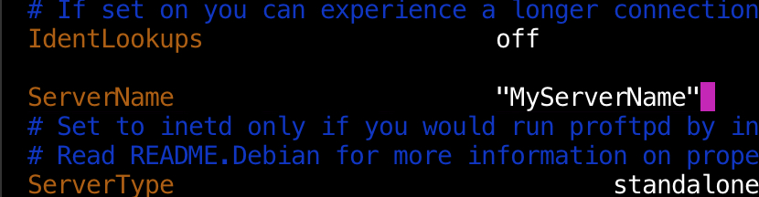
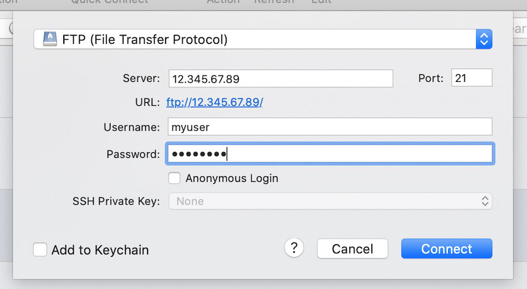
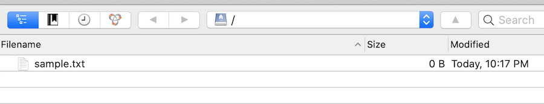
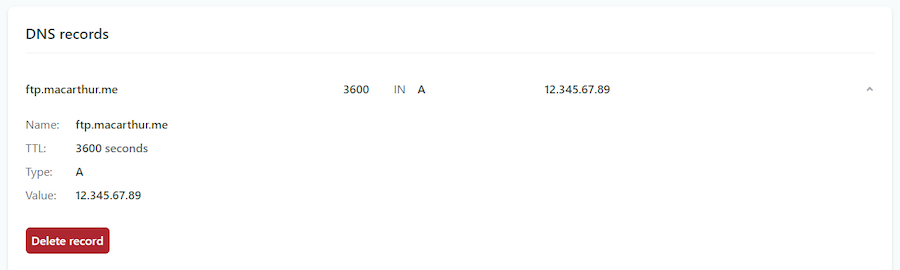

A project of mine recently needed a simple FTP server that can give multiple different users access to the contents of specific directories (and _only_ those directories). My technical requirements were stupid simple, the data I'd be dealing with wasn't sensitive, and I wanted to avoid paying for an expensive and/or complicated service, at least to start.

I did some brief discovery and determined that a good, ol' DigitalOcean droplet is a great candidate for hosting a simple server like this. This is essentially a set of my beautified notes on the process of setting that up.

Before starting, let's set some expectations: this implementation is very bare-bones, and it isn't concerned with making everything as secure as possible. If you're looking on setting up a server with an SFTP protocol, or in-depth configuration capabilities, you might need to use what you see here as the foundation, but you'll need to search elsewhere for the rest.

## Getting Started

To start, I'm assuming you have a DigitalOcean droplet running on Ubuntu, and that you're able to access it via SSH. We'll be spending most of our time inside the droplet, so go ahead and log in.

```bash
ssh root@YOUR.IP.ADDRESS
```

## Configuring Your FTP Server

We'll be using [ProFTPD](http://www.proftpd.org/) for our FTP server. It's a pretty reputable tool that's straightforward to set up. Work through these steps:

Install the tool. The `update` may be especially important, depending on your version of Ubuntu (I'm on 20.04):

```bash
apt-get update && apt-get install proftpd
```

Add `/bin/false` to our list of valid shells in our droplet. ProFTPD's default configuration will require that a valid shell be used to gain access, and we'll be using this particular value to prevent direct shell access to the system.

```bash
echo '/bin/false' >> /etc/shells
```

Although it's technically optional for a stupid-simple setup, you can modify the default configuration file generated when installing ProFTPD. If you want, I'd at least recommend changing the server name to something more personalized:

```bash
vi /etc/proftpd/proftpd.conf
```



## Setting Up Directories, Users, and Permissions

After that, create a new user that'll have access to the FTP server.

```bash
useradd --shell /bin/false yourusername
```

Set a password for that user:

```bash
passwd yourusername
```

At this point, we need to set up specific directories that we'll allow your users to access. To do that, let's create one and then assign permissions to it:

```bash
mkdir /home/somedirectory
chown yourusername:yourusername /home/somedirectory
```

With all of that in place, restart the server for everything to take effect:

```bash
service proftpd restart
```

And finally, let's create an empty file in our user's directory just to have something we can verify when we try to connect.

```bash
echo "Test!" > /home/somedirectory/sample.txt
```

## Accessing Your Server

Open up an FTP client (like [Cyberduck](https://cyberduck.io/)), fill in your IP address as the "server," and use the credentials you created above to log in. Make sure the port is set to `21`.



After logging in by clicking "Connect," you should see the `sample.txt` file we created in the user's directory.



## Setting Up a Custom Domain

Although it's not required, it's nice to have a dedicated domain set up for users to connect to the server (ex: `ftp.macarthur.me`). To do that, create an `A` record in your DNS management tool that points to the subdomain or domain you'd like to use. In my case, that UI looked something like this:



Afterwards, you should be able to point your FTP client to that new domain when connecting:

## That's It.

Told you it was quick.
