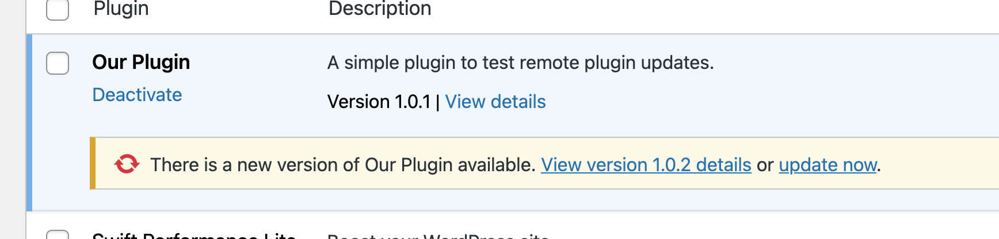

A while ago, I wrote a premium WordPress plugin for creating typewriter effects with [TypeIt](https://typeitjs.com/) via shortcode or Gutenblock. I was ill-prepared for the trickiness of managing plugin updates for such a plugin. Since a premium plugin is monetized, it can't live inside the WordPress Plugin Repository like free options can, and asking paying customers to manually upload the a ZIP file for each new release is a clunky, less-than-ideal option.

## Serverless to the Rescue

The go-to solution for this problem is to set up a custom update server. With this approach, your plugin checks for updates the same way any other plugin does, but instead of asking the Plugin Repository for those updates, it's configured to ask your server.

Just a short while ago, setting this up was quite a chore, since it required you to create and maintain a separate application just to allow your users to easily get updates. But with the serverless/lambda function landscape now so accessible, it's pretty simple to roll one of these on your own with neither much hassle nor cost.

Let's explore just how simple that is by setting up own serverless plugin update function that can be used to manage an unlimited number of your premium plugin updates, as well as what it takes to configure a plugin to actually use this function.

## Choose a Platform & Get Set Up

The number of companies offering serverless function platforms with minimal configuration are plenty, with the top two contenders arguably being [Netlify](https://www.netlify.com/) and [Vercel](http://vercel.com/). For this setup, we'll be using the latter, although the fundamentals are largely similar, with the primary differences being the proprietary tools and configuration patterns required by each.

### Set Up a Vercel Project

On your machine, create a directory and initialize it as a Git repository.

```jsx
mkdir wp-plugin-update-function-example
cd wp-plugin-update-function-example
git init
```

After [installing and authenticating](https://vercel.com/docs/cli) with the Vercel CLI, initialize your project by running `vercel` and following the prompts. See Vercel's solid documentation on then [linking this new project with a remote Git repository.](https://vercel.com/docs/git) Once you're finished, a `.vercel` directory containing some project configuration should have been generated in the project on your machine.

### Run the Project

After the project is initialized, spin up a local development server by running `vercel dev`. You should see a message indicating that the server is available at `http://localhost:3000` (assuming nothing else is running there already).

## Create a Basic Function Triggered by a GET Request

Create an `api` directory and a file named `[plugin].js`. This'll serve as a [path segment](https://vercel.com/docs/serverless-functions/introduction#path-segments) that we'll use to pass plugin slugs through to the function. You could also go with the URL query parameter approach. That decision is up to you.

```bash
mkdir api && touch "api/[plugin].js"
```

Inside that newly created `[plugin].js` file, let's start with something simple just to verify things are working. Using this, we'll pull the `plugin` parameter from the URL path -- dictated by the name of our file -- and immediately spit back a bit of JSON.

```js
export default (req, res) => {
  const {
    query: { plugin },
  } = req;

  return res.json({
    version: "0.0.0",
    package: `http://localhost:3000/plugins/${plugin}/0.0.0.zip`
  });
};
```

Now, navigate to `http://localhost:3000/api/our-plugin`, and you should see some JSON output on the screen. The structure of that blob is important; it's what we'll later use to communicate to a WordPress site wondering if a plugin should be updated. More on that as we go.

### Retrieve the Latest Plugin Version Information

Next, let's make a means of surfacing information about a particular plugin whenever a `GET` request is made to our endpoint.

First off, we'll create a directory to store the ZIP files for our different plugin versions. Go ahead and create a `plugins/our-plugin` directory, and place a zipped version of our plugin within that.

<div class="alert">
  <p>
    We're building this function in a way that only requires to you to upload newer ZIP files to the function's repo as new plugin releases come out, leaving the older versions in place. It's simpler to use, and it's also handy in case customers request a download link for an older version of a plugin. If you don't need this level of complexity, feel free to rip stuff out as desired.
  </p>
</div>

The naming convention for that file is important, since we'll use that for determining what the latest available version is. It should named by the version represented by the zipped contents. For example, `1.0.2.zip`. With that ZIP added to the mix, our directory tree should look something like this:

```
.
├── api
│   └── plugin
│       └── [plugin].js
└── plugins
    └── our-plugin
        └── 1.0.2.zip
```

### Parse Latest Version Information

At this point, we're ready to surface latest version data when a request is made. To do that, we're gonna go through a series of steps:

- Access every available version in the `plugins` directory.
- Filter out any non-`.zip` files (particularly while developing locally; some hidden "dot" files can sneak in).
- Sort the file names by version, descending (go ahead and run `npm install compare-versions` for this step.
- Grab the first file name in the list. This will be our newest version available.

In code, that'll look like this:

```diff
+ const compareVersions = require('compare-versions');
+ const { readdirSync } = require('fs');
+ const { join } = require('path');

export default (req, res) => {
  const {
      query: { plugin },
  } = req;

+ // Read all files in directory.
+ const zips = readdirSync(join(process.cwd(), 'plugins', plugin))
+     // Remove any non-ZIP files.
+     .filter(fileName => fileName.endsWith('.zip'))
+
+     // Collect only the file names, without file extension.
+     .map(fileName => fileName.match(/(.+)\.zip$/)[1])
+
+     // Sort those file names (which are the version numbers).
+     .sort(compareVersions).reverse();
+
+ const latestVersion = zips[0];

  return res.json({
-   version: "0.0.0",
+   version: latestVersion,
-   package: `http://localhost:3000/plugins/${plugin}/0.0.0.zip`
+   package: `http://localhost:3000/plugins/${plugin}/${latestVersion}.zip`
  })
};
```

If you refresh your browser, you should see that same JSON blob we got earlier, but filled in with the correct version information:

```json
{
  "version": "1.0.2",
  "package": "http://localhost:3000/plugins/our-plugin/1.0.2.zip"
}
```

There's one more tweak we should make in case someone requests information for a plugin we don't manage:

```diff
const compareVersions = require('compare-versions');
const { readdirSync } = require('fs');
const { join } = require('path');

export default (req, res) => {
  const {
    query: { plugin },
  } = req;

+ try {
    const zips = readdirSync(join(process.cwd(), 'plugins', plugin))
      .filter(fileName => fileName.endsWith('.zip'))
      .map(fileName => fileName.match(/(.+)\.zip$/)[1])
      .sort(compareVersions)
      .reverse();

    const latestVersion = zips[0];

    return res.json({
      version: latestVersion,
      package: `http://localhost:3000/plugins/${plugin}/${latestVersion}.zip`
    })
+ } catch (e) {
+    return res.status(404).json({
+      message: `Sorry, couldn't find data for '${plugin}'.`,
+    });
+ }
};
```

Now, if you make a request to our function using a non-existent plugin slug, you should get a `404` status code, which is a bit more appropriate for the type of error that occurred.

And just like that, we have our own custom plugin update server ready in place. The next piece is configuring our plugin to check for updates & pull from that endpoint, rather than the WordPress Plugin Repository.

## Configure a WordPress Plugin to Use Update Server

WordPress uses an `update_plugins` transient to keep track of which plugins have been checked for updates recently, and which are due for another check. We can hook into & filter the value of that transient using the [`site_transient_update_plugins` filter](<https://github.com/WordPress/wordpress-develop/blob/97790af164b20a72640b3497af4c5a3986d8cf32/src/wp-includes/option.php#L1957>). By doing this, we'll be able seize control of where WordPress looks to see if an update is ready.

But _before_ we start to stub out that filter, let's write a simple function for fetching fresh plugin data via `GET` request to our endpoint. With the following, we're making that request, accounting for a possible error, and returning the raw JSON.

```php
define("PLUGIN_CHECK_ENDPOINT", "http://localhost:3000/api/our-plugin");

function fetch_remote_data() {
  $remoteData = wp_remote_get(
    PLUGIN_CHECK_ENDPOINT,
    [
      'headers' => [
        'Accept' => 'application/json'
      ]
    ]
  );

  // Something went wrong!
  if (
    is_wp_error($remoteData) ||
    wp_remote_retrieve_response_code($remoteData) !== 200
  ) {
    return null;
  }

  // {
  //    "version":"1.0.2",
  //    "package":"http://localhost:3000/plugins/our-plugin/1.0.2.zip"
  // }

  return json_decode($remoteData['body']);
}
```

Now, let's tweak that to return an object with an interface expected by WordPress's plugin update system, populating the `new_version` and `package` properties with the data from our endpoint. (If you wanna dig into that more, [see here](https://make.wordpress.org/core/2020/07/30/recommended-usage-of-the-updates-api-to-support-the-auto-updates-ui-for-plugins-and-themes-in-wordpress-5-5/).) As for the rest, feel free to fill things in as needed.

```diff
define("PLUGIN_CHECK_ENDPOINT", "http://localhost:3000/api/our-plugin");

function fetch_remote_data() {
  $remoteData = wp_remote_get(
    PLUGIN_CHECK_ENDPOINT,
    [
      'headers' => [
        'Accept' => 'application/json'
      ]
    ]
  );

  // Something went wrong!
  if (
      is_wp_error($remoteData) ||
      wp_remote_retrieve_response_code($remoteData) !== 200
  ) {
      return null;
  }

- return json_decode($remoteData['body']);
+ $remoteData = json_decode($remoteData['body']);
+
+ return (object) [
+     'id'            => 'our-plugin/our-plugin.php',
+     'slug'          => 'our-plugin',
+     'plugin'        => 'our-plugin/our-plugin.php',
+     'new_version'   => $remoteData->version,  // <-- Important!
+     'url'           => 'https://macarthur.me',
+     'package'       => $remoteData->package,  // <-- Important!
+     'icons'         => [],
+     'banners'       => [],
+     'banners_rtl'   => [],
+     'tested'        => '',
+     'requires_php'  => '',
+     'compatibility' => new \stdClass(),
+ ];
}
```

Now, we're ready to start filtering the `update_plugins` transient. To start, let's stub out our filter and fetch the fresh data using the function we just wrote above. We'll also pull in a means of grabbing the current installed version of our plugin, since we'll later need to that to compare against our remote version.

```php
add_filter('site_transient_update_plugins', function ($transient) {
  $pluginData = fetch_remote_data();

  return $transient;
});
```

And now, it's as simple as doing a version comparison, which PHP makes relatively easy with it's `version_compare` function:

```diff
+ require_once(ABSPATH . 'wp-admin/includes/plugin.php');
+
+ $currentPluginData = get_plugin_data(__FILE__);

add_filter('site_transient_update_plugins', function ($transient) {
  $pluginData = fetch_remote_data();

+ if (version_compare($pluginData->new_version, $currentPluginData["Version"], ">")) {
+   $transient->response['our-plugin/our-plugin.php'] = $pluginData;
+ } else {
+   $transient->no_update['our-plugin/our-plugin.php'] = $pluginData;
+ }

  return $transient;
});
```

The magic here is in that `$transient->PROPERTY` stuff. If our remote version is _larger_ than the version we have installed, we'll tell WordPress to prompt for an update by sticking it on the `response` property, which is an array whose keys are a WordPress site's plugins' root files. But if the plugin is not eligible for an update, we're sticking it onto the `no_update` property, and no update will be prompted.

### Testing It Locally

With things as they are, we're _technically_ sorta done. If you artificially set your local plugin's version to something lower than what the remote endpoint is providing, you'll see an update prompt:



But! Unfortunately, since our update endpoint is on `localhost`, WordPress will, by default, not allow a ZIP file to be pulled from it. So, for local testing, let's turn that feature off using the filter below. **Ideally, don't put this in your plugin's code.** You don't want to accidentally ship it.

```php
add_filter('http_request_args', function ($args) {
  $args['reject_unsafe_urls'] = false;

  return $args;
});
```

After that's in place, there's another key step: **commit & push up your plugin's code**, since it's about to get wiped out with a "new" version, and you'll need a way to revert it. Then, go ahead and attempt to run the update from the WordPress admin. It should work.

But! There's still work to be done. In its current state, our code requires that our endpoint be hit every time it's run. That's an unnecessarily burdensome process (you'll likely notice it every time you refresh the WordPress admin), especially when we have transients at our disposal.

### Make Things More Efficient

Using a simple [transient](https://developer.wordpress.org/apis/handbook/transients/), we can cache the payload from our endpoint until a certain amount of time passes. Let's set one to expire after 12 hours, and set up some simple logic to first check for a transient value before hitting our serverless function.

```diff
require_once(ABSPATH . 'wp-admin/includes/plugin.php');

define("PLUGIN_CHECK_TRANSIENT_EXPIRATION", 43200); // 12 hours
define("PLUGIN_CHECK_TRANSIENT_NAME", "wp_update_check_our_plugin");

$currentPluginData = get_plugin_data(__FILE__);

add_filter('site_transient_update_plugins', function ($transient) {
+ $checkPluginTransient = get_transient(PLUGIN_CHECK_TRANSIENT_NAME);
+
+ $pluginData = $checkPluginTransient ?: fetch_remote_data();
- $pluginData = fetch_remote_data();

  if (version_compare($pluginData->new_version, $currentPluginData["Version"], ">")) {
    $transient->response['our-plugin/our-plugin.php'] = $pluginData;
  } else {
    $transient->no_update['our-plugin/our-plugin.php'] = $pluginData;
  }

  return $transient;
});
```

And finally, if that transient is due for a refresh, set it with what we receive from our endpoint.

```diff
require_once(ABSPATH . 'wp-admin/includes/plugin.php');

define("PLUGIN_CHECK_TRANSIENT_EXPIRATION", 43200); // 12 hours
define("PLUGIN_CHECK_TRANSIENT_NAME", "wp_update_check_our_plugin");

$currentPluginData = get_plugin_data(__FILE__);

add_filter('site_transient_update_plugins', function ($transient) {
  $checkPluginTransient = get_transient(PLUGIN_CHECK_TRANSIENT_NAME);

  $pluginData = $checkPluginTransient ?: fetch_remote_data();

+  if (!$checkPluginTransient) {
+   set_transient(
+     PLUGIN_CHECK_TRANSIENT_NAME,
+     $pluginData,
+     PLUGIN_CHECK_TRANSIENT_EXPIRATION
+   );
+ }

  if (version_compare($pluginData->new_version, $currentPluginData["Version"], ">")) {
    $transient->response['our-plugin/our-plugin.php'] = $pluginData;
  } else {
    $transient->no_update['our-plugin/our-plugin.php'] = $pluginData;
  }

  return $transient;
});
```

Now, if you were to refresh your WP admin a few times, you'll notice that things are performing much more smoothly, since our serverless function will only need to be hit every 12 hours at the most.

## See a Live Example

Everything you're reading here was put into practice with one of my own plugins. If you'd like to take a glace at that code (with some various adjustments to suite my specific needs), check out the repositories below:

* [TypeIt WordPress plugin](https://github.com/alexmacarthur/wp-typeit)
* [serverless function](https://github.com/alexmacarthur/wp-plugin-update-lambda)

## Any Gotchas?

One of the primary motivators I had for writing this was the fact that I couldn't find any ultra-clear documentation for the process myself. That said, I welcome any feedback or unexpected gotchas you hit along the way.

<span class="thx">Thanks for reading!</span>

<script src="https://unpkg.com/typeit@8.0.3/dist/index.umd.js">
</script>

<script>
  new TypeIt('.thx', {
    waitUntilVisible: true,
    loop: true
  }).go();
</script>

<style>
  .ti-cursor {
    --ti-font-weight: 100;
    --ti-font-size: 1.5rem;
    padding-left: 3px !important;
    display: inline-block !important;
    transform: translateY(3px) !important;
  }
</style>
