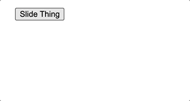

Back when I was working on [slide-element](https://github.com/alexmacarthur/slide-element), I noticed an issue that would occur when I rapidly toggled an element open & closed. If the previous animation wasn't allowed to finish, the new one would eventually get outta whack, clipping the content on subsequent animations.



## The Cause of the Weirdness

This was happening because each time an animation was triggered, I was grabbing the current "raw" height of the opened element, regardless of whether it was in the middle of an active animation. The library uses the Web Animations API, so the frame construction looked like this:

```jsx
// For each trigger, animate between zero and the `clientHeight` of the element.
let frames = ["0px", `${element.clientHeight}px`].map((height) => {
  return { height, overflow: "hidden" };
});
```

To fix it, I needed to calculate and cache the expanded height once when `slide-element` is first used, and then refer back to that cached value every time an animation is triggered. That way, for each page load, there'd be one, fixed expanded height value to animate to and from, and no more weirdness caused by rapid clicking.

## Weighing My Options

A couple of potential solutions quickly came to mind.

**First, storing that value in a `data` attribute on the target element.** This would've done the job, but I have this admittedly weird thing with limiting the amount of data I persist this way. When I inspect the page, I don't want to see a cluster of different attributes cluttering up the markup, particularly if other libraries require their own attributes to exist as well. I've worked with various other tools that, when used in parallel, led to some pretty convoluted markup, and I've been scarred a bit by those experiences. That history and the fact that I was curious if there'd be a more "interesting" way to pull this off, I opted out of this option.

**Second, I thought of sticking a "cache" on the `window` object** (deal with it). But there could be _several_ sliding elements on a page at once. So, a single `window.seCache` (or something like it) variable wouldn't cut it. That value would need to be some sort of key:value pair (like a simple object) in which I could store a reference to each element and the respective expanded height value.

I was open to this general idea, but it had a `key` (lol) limitation: plain old objects don't permit you to use HTML nodes as properties, so I'd need to require that a unique identifier exist on each element in order to store their expanded heights reliably. That's a change I wasn't eager to make.

### Using DOM Nodes As Keys

I was momentarily taken aback after first publishing this post, however, when [a friend](https://www.quickwinswithcode.com/) reached out about about the fact that using nodes as property names _sorta_ work within ES2015's ["computed property names"](https://developer.mozilla.org/en-US/docs/Web/JavaScript/Reference/Operators/Object_initializer#computed_property_names) specification. He shared the following sort of example, which kinda blew my mind.

```html
<span id="el1">first element</span>
<span id="el2">second element</span>

<script>
  const someObj = {
    [document.getElementById('el1')]: 'some value'
  };

  console.log(someObj[document.getElementById('el1')]);
  // 'some value'
</script>
```

Yep, accessing that value via a DOM _does_ return the desired value. But, after digging in a little more, I realized that it wasn't performing a lookup based on the reference to that object. Instead, it was transforming it to a string representation of that object, and then using _that_ as the key:

```js
console.log(Object.keys(someObj));
// ['object HTMLSpanElement']
```

And that means any of the following would access the same value as well:

```js
console.log(someObj[document.getElementById('el2')]);
// 'some value'

console.log(someObj[document.createElement('span')]);
// 'some value'
```

While that didn't flesh out, there was another option: **a set of new-ish native JavaScript objects that allow you to use objects for keys -- including references to DOM nodes themselves**. Those are the [Map](https://developer.mozilla.org/en-US/docs/Web/JavaScript/Reference/Global_Objects/Map) and [WeakMap](https://developer.mozilla.org/en-US/docs/Web/JavaScript/Reference/Global_Objects/WeakMap) objects. For example:

```html
<span id="thing" class="thing">a thing.</span>

<script>
const myWeakMap = new WeakMap();

// Set a value to a specific node reference.
myWeakMap.set(document.getElementById('thing'), 'some value');

// Access that value by passing the same reference.
console.log(myWeakMap.get(document.querySelector('.thing')); // 'some value'
</script>
```

My use of a WeakMap is intentional here. A standard Map would do the trick, but a WeakMap as a marginal advantage in my case: [the keys are not protected from the garbage collection process](https://developer.mozilla.org/en-US/docs/Web/JavaScript/Guide/Keyed_collections#weakmap_object) (thanks to [CreativeTechGuyGames](https://www.reddit.com/user/CreativeTechGuyGames/) on Reddit for this tip!). As soon as all other references to an object cease to exist, that item in a WeakMap becomes a candiate for garabage collection, preventing a potential (albeit small) memory leak.

With this tool at my disposal, rigging up an expanded height cache for each target element became relatively straightforward:

1. Create a dedicated WeakMap for storing expanded element heights.
2. When `slide-element` is called on an element, create a key in that WeakMap and store the full, pre-animated height.
3. Whenever it's needed, first check that WeakMap for the height for the respective node.

In rather contrived & simplified code, the logic came to look something like this:

```javascript
window.seCache = window.seCache || WeakMap.new();

function getExpandedHeight() {
  // We already have the calculated height.
  if(window.seCache.get(element)) {
    return window.seCache.get(element);
  }

  // This is the first run. Calculate & cache the full height.
  element.style.display = "block";
  window.seCache.set(element, element.clientHeight);
  element.style.display = "none";

  return window.seCache.get(element);
}

// For each trigger, animate between zero and the `clientHeight` of the element.
let frames = ["0px", `${getExpandedHeight()}px`].map((height) => {
  return { height, overflow: "hidden" };
});
```

And there we have it. A far more interesting solution than 2010's data attributes. 😜

## Way More Useful Than I Thought

For whatever reason, I didn't think there'd be much utility to a brand new JavaScript object that enables you to use objects as keys, as well as anything other feature it offered (why wouldn't a basic object cover my every need?). So, when I finally came across a use case for it, I got pretty pumped. Hopefully, this all nudges your mind to think of the tool when the appropriate need arises.

Apologies to whomever proposed this thing.
