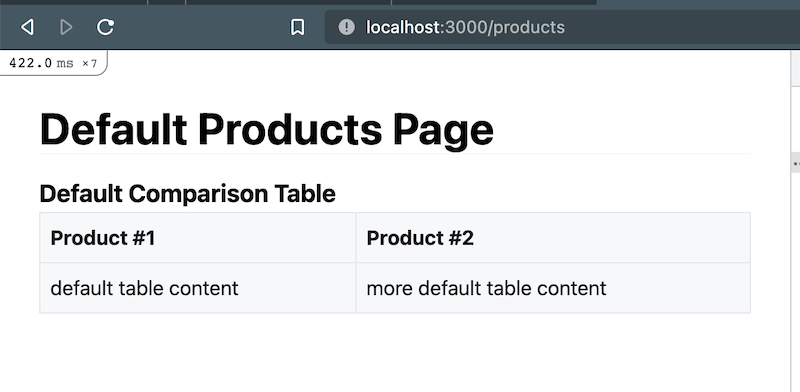
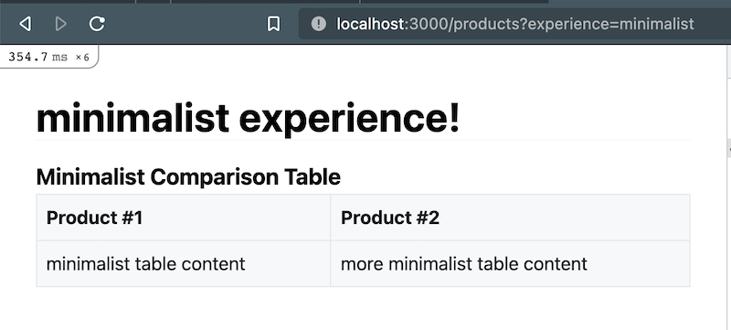
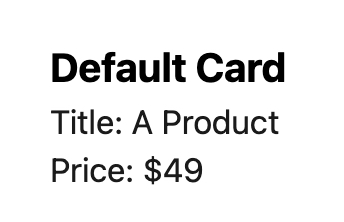
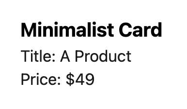

A while back, I was working in a Ruby on Rails project in which we wanted to test out different versions of features within our application, most of which were housed in separate ERB partials. 

For each feature, there'd be a default "experience", but when a certain condition was met, we'd render an alternative, which might've contained slightly different markup, styles, or something else. To pull it off, we needed a way to maintain these different variants, as well as a means of reliably serving them whenever a particular experience was activated. 

This scenario led me down the path of exploring conditional template rendering with the two most popular approaches to handling ERB templates Rails — the [Action View module](https://doc.bccnsoft.com/docs/rails-guides-4.2.1-en/action_view_overview.html), and the [View Component gem](https://viewcomponent.org/). Under more typical circumstances, we'd be able to leverage the "variants" feature offered by both solutions. But this was complicated by the fact that we wanted our variant templates to live in a different directory from our defaults (they wouldn't be siblings). This post is mostly just a recap of how I prototyped this somewhat unusual need with both of these tools.

## Conditional Rendering w/ Action View

Out of the two approaches I explored, Action View definitely requires the least amount of lift, being that I could largely rely on out-of-the-box functional`ity provided by Rails.

### Template File Structure

First, a quick overview of the template organization scheme with which I started. The default feature template would live in the standard `views` directory), and then for each variant, a template by the same name would reside in a directory housed under `views/experiences`. For example, consider an application with a `ProductController` and a single `index` action: 

```ruby
class ProductController < ApplicationController
    def index; end
end
```

And within the associated `app/views/product/index.html.erb` file, a `_comparison-table.erb` template is rendered:

```html
<h1>Default Products Page</h1>

<%= render "comparison-table" %>
```

When navigating to that route in the browser, some sort of "default" experience would be rendered: 



Now, imagine that "minimalist" and "maximalist" experiences were introduced for the application. Each of these experiences would have a dedicated directory (named according to that experience) that housed the alternative templates **using the same folder structure** (in this case, under the `product` namespace).

```bash
|-- app/
    |-- views/
        |-- experiences/
            |-- minimalist/
                |-- product
                    |-- _comparison-table.html.erb	
                    |-- index.html.erb
            |-- maximalist/
                |-- product
                    |-- _comparison-table.html.erb
                    |-- index.html.erb
        |-- product
	        |-- _comparison-table.html.erb
				|-- index.html.erb
```

While arguably a little more complicated than dealing strictly with sibling template variants, this still feel pretty maintinable. When a new experience is introduced, I'd simply duplicate the relevant template files and tweak away.

### Overriding Where Templates Are Searched

At the start of this, I assumed we'd now need to build out some sort of abstraction on top of Rails' standard `render` method in order determine which template to show. But shortly after digging in, I ran into the `prepend_view_path` method within the `ActionView` module.

This method is responsible for [prepending paths in which Rails searches for templates to render](https://api.rubyonrails.org/classes/ActionView/ViewPaths/ClassMethods.html#method-i-prepend_view_path). By default, that list of paths only contains `app/views`, but if you'd like Rails to look in another location first, you can configure that in a `before_action` hook. The following, for example, would tell any controller in an application to *first* look in the `app/views/experiences/minimalist` directory.

```ruby
class ApplicationController < ActionController::Base
	before_action :prepend_experience_path
    
	def prepend_experience_path
		prepend_view_path "app/views/experiences/minimalist"
	end
end
```

Then, whenever the `render` method is used in an ERB template, the "minimalist" template would be pulled — no other special implementation or custom code necessary: 

```html
<!-- 
	First searches for:
    `app/views/experiences/minimalist/product/_comparison-table.html.erb` 
-->
<%= render "comparison-table" %>
```

Plus, this feature includes the *implicit* use of `render` directly within a controller action:

```ruby
class ProductController < ApplicationController
	# First searches for:
	# `app/views/experiences/minimalist/product/index.html.erb`
    def index; end
end
```

The nice part about this is that it falls back gracefully. If no template is found in that path, Rails will move onto the remaining list of paths to check. Using that most previous example, if `index.html.erb` didn't exist within the `minimalist` experience path, it'd fall back to `app/views/product/index.html.erb` — the default experience.

### Setting a Particular Experience

At this point, I needed a means of determining which experience is active for a given user, and then use that experience to choose the directory that's first searched for templates. There's a gazillion ways this might be handled (the database, a third-party feature flag tool, etc.), but for simplicity of demonstration, I'll use a `?experience=experience_name` query string parameter in the URL. Here's how that'd look in the inherited `ApplicationController`:

```ruby
class ApplicationController < ActionController::Base
    before_action :prepend_experience_path

    # Only search in an "experience" directory if a query param is set in the URL.
    def prepend_experience_path
        prepend_view_path "app/views/experiences/#{experience}" if experience.present?
    end

private

	def experience
		params[:experience]
	end
end
```

On each request, the specified experience is pulled from the `params` object with our `experience` method. Then, I'm prepending that particular experience's path. Following the earlier example, if I were to navigate to the same page with the experience set in the URL, the page would now render something like this: 



Easy conditional template rendering... by just leveraging what Rails gives us anyway!

## Conditional Rendering  w/ ViewComponents

If you're not that familiar with GitHub's [view_component](https://github.com/github/view_component) gem, check it out. It toutes some pretty sick advantages — performance, testability, and encapsulation, to mention a few. 

Unfortunately, conditionally rendering different templates with ViewComponents is a little more complicated than with Action View. As far as my digging through the code & documentation went, there's neither (yet) a public API for controlling where `.erb` templates are searched, nor a blessed means of dictating which template should be rendered for a given component. Regardless, it's possible to pull off for my specific use case. Here's the approach I took:

### An Example Component

I used a simple "ProductCard" component for trying this out, which comes with a `ProducCardComponent` class that accepts `title`, `price`, and `experience` (which we'll use to determine the rendered template) parameters: 

```ruby
# /app/components/product_card_component.rb

class ProductCardComponent < ViewComponent::Base
    def initialize(title:, price:, experience: "")
        @experience = experience
        @title = title
        @price = price
    end
end
```

And then there's the ERB template itself:

```html
<!-- /app/components/product_card_component.html.erb -->

<div>
    <h4>Default Card</h4>
    Title: <%= @title %>
    <br />
    Price: $<%= @price %>
</div>
```

Inside an ERB template, that's instantiated like so:

```html
<!-- app/views/index.html.erb -->

<%= render(ProductCardComponent.new(title: "A Product", price: 49, experience: experience)) %>
```

Which ends up looking like this:



### Taking Over Template Rendering

By default, ViewComponent looks for a sibling ERB file within the `app/components` directory. But, as [an alternative](https://viewcomponent.org/guide/templates.html#inline), it's possible to render content returned from a `call` method attached to the component class. And that can be used (or slightly hacked) to take full control over what's rendered under certain conditions. Here's how I started to wire that up:

```diff
class ProductCardComponent < ViewComponent::Base
    def initialize(title:, price:, experience: "")
        @experience = experience
        @title = title
        @price = price
    end

+   # Grab a template's contents and turn it into HTML.
+   def call
+   	template_contents = File.read(template_path)
+          
+       ERB.new(template_contents).result(binding).html_safe
+   end
+   
+private
+   
+   # Use the same template path ViewComponet uses by default.
+   def template_path
+       @template_path ||= "#{Rails.root}/app/components/#{self.class.name.underscore}.html.erb"
+   end
end
```

With this change, I'm manually compiling our own ERB templates using the included `ERB` renderer (note: that `.result(binding)` piece is important — it'll allow access to instance variables from within the template). That template is being targeted by transforming the name of the current class into the same format expected by ViewComponent. 

If you're following along on your own and refresh the page at this point, you'd get an error. That's because, out of the box, ViewComponent [does not permit you to have both](https://github.com/github/view_component/blob/main/lib/view_component/compiler.rb#L121) a template in your `app/components` directory, *and* a `call` method on your class. To get around this hurdle and allow the component's templates to remain in the standard `app/components` directory, I did a little meta-programming (and no, I did not feel spectacular about it): 

```diff
class ProductCardComponent < ViewComponent::Base
    def initialize(title:, price:, experience: "")
        @experience = experience
        @title = title
        @price = price

+       wipe_out_templates
    end

	def call
		template_contents = File.read(template_path)
        
        ERB.new(template_contents).result(binding).html_safe
    end
 
private
 
    def template_path
        @template_path ||= "#{Rails.root}/app/components/#{self.class.name.underscore}.html.erb"
    end

+   # Fake ViewComonent into thinking there are no templates in `app/components`.
+   def wipe_out_templates
+       self.class.class_eval do
+           def self._sidecar_files(_extensions)
+               []
+           end
+       end
+   end
end
```

With this in place, each time the component is instantiated, the static `_sidecar_files` method is overridden (a class method that literally has the word "EXPERIMENTAL" above it [in the source](https://github.com/github/view_component/blob/main/lib/view_component/base.rb#L309), lol). That override stomps out its original implementation, making the library believe that there are actually no ERB templates living in the directory. A little dirty-feeling, but still. Onward!

### Conditionally Rendering Templates

Next up, I needed to introduce the logic for choosing a different template when a certain experience is active. To do that, I modified the `template_path` method and include two more: 

```ruby
def template_path 
    @template_path ||= File.exist?(experience_template_path) ? experience_template_path : standard_template_path
end

def experience_template_path
    @experience_template_path ||= "#{Rails.root}/app/components/experiences/#{@experience}/#{self.class.name.underscore}.html.erb"
end

def standard_template_path
    @standard_template_path ||= "#{Rails.root}/app/components/#{self.class.name.underscore}.html.erb"
end
```

Now, the component will first always check to see if it can render a template based on whatever experience is set (which might be none). If it can't, the "standard" template will be used.

### A Bit of Clean-Up

For housekeeping purposes, this can be arranged differently for better reuse among all components that might be introduced. To do that, I created a new `ExperienceableComponent` class from which all of my components extend, which will be responsible for containing all of this custom rendering logic. Altogether, it looked like this:

```ruby
class ExperienceableComponent < ViewComponent::Base
    def initialize(*)
        wipe_out_templates
    end

    def call
        template_contents = File.read(template_path)
        
        ERB.new(template_contents).result(binding).html_safe
    end

private 

    def template_path 
        @template_path ||= File.exist?(experience_template_path) ? experience_template_path : standard_template_path
    end

    def experience_template_path
        @experience_template_path ||= "#{Rails.root}/app/components/experiences/#{@experience}/#{self.class.name.underscore}.html.erb"
    end

    def standard_template_path
        @standard_template_path ||= "#{Rails.root}/app/components/#{self.class.name.underscore}.html.erb"
    end

    def wipe_out_templates
        self.class.class_eval do
            def self._sidecar_files(_extensions)
                []
            end
        end
    end
end
```

After that abstraction, the actual component class can look a lot simpler: 

```ruby
class ProductCardComponent < ExperienceableComponent
    def initialize(title:, price:, experience: "")
        @experience = experience
        @title = title
        @price = price

        super
    end
end
```

With things feeling a little tidier, navigating to the same page with `?experience=minimalist` in the URL renders exactly what I wanted: 



And there you go. Despite the slight hackiness, we got it running! 

## Rails Developers are Smart

If there's anything I really came to realize during all of this exploration, it's that there's a *ton* of considerations the Action View & ViewComponent contributors have balanced with excellence as they built (and continue to build) out these UI-rendering solutions. I can't imagine building out a package of such scale that satisfies so many different use cases, including my own. But they did it. So, a brief message to those contributors: You're a lot smarter than I am. But I'mma catch you.

Thanks for tagging along!
