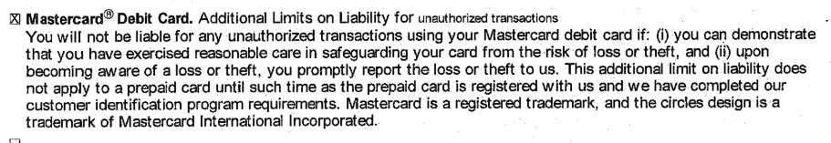

I’ve lived without a credit card for nearly a decade now. Life hasn’t been hard without one. With a debit card (backed by my own, real money) readily available and accepted anywhere a credit card is, I wouldn’t even say it’s been inconvenient. 

Even so, more than a few times, I’ve been roped into (or instigated, lol) hearty discussions with people who insist that there are indisputable reasons why I and everyone else should have a credit card. Despite some of those reasons being total garbage (”get a 20% discount on these American Eagle pants!”), I’ve found a few to be fairly compelling on more than one occasion — enough to make me think about whether my plastic abstinence is more rooted in dogma than reason. But time after time, thinking through even the best of these reasons only lands me right back where I've stood for several years now. 

I’ve thought about it enough times now to warrant getting something written down; if anything, for the purpose of being able to point people to resource when I don’t have the patience to try to regurgitate thoughts from scratch in the moment.

So, here they are: my three favorite reasons to get a credit card, and why they’re still not good enough for me.

## 1. "Credit cards are safer than debit cards."

This one gets me because it strikes right at my security gland. And it also comes off as pretty agreeable, because credit cards _do_ offer solid protection in the event that either your number or physical card is used fraudulently. In fact, it's the law. The [Fair Credit Billing Act](https://www.experian.com/blogs/ask-experian/what-is-the-fair-credit-billing-act/) shields you from any responsibility for charges that occur after you report a stolen card. And even if the bad guys did rack up any charges before then, the maximum amount you're responsible for is $50.

But even paying _that_ is pretty rare. Most major credit cards have [zero-liability policies](https://www.investopedia.com/terms/z/zero-liability-policy.asp), meaning you won't owe a cent on anything purchased by anyone but yourself — no matter how or when the purchase was made. It's little surprise that people tout the peace of mind credit cards offer in this way, especially in an age when online commerce dominates. You'd be hard-pressed to find yourself out of any sum of money due to someone getting a hold of your card, either physically or digitally.

**But! It's also true that debit cards enjoy virtually the same level of security.** And in an increasing number of cases, those protections are *exactly* the same. This type of plastic isn’t covered by the same legislation as credit cards. Rather, they fall within the scope of the [Electronic Fund Transfer Act](https://www.ftc.gov/enforcement/statutes/electronic-fund-transfer-act). Under that law, the following protections are in force when your debit card becomes compromised, depending on how it happened:

#### Physical Card is Lost/Stolen

| Reported Within      | Maximum Liability |
| ----------- | ----------- |
| within two days      | $50       |
| within 60 days   | $500        |
| greater than 60 days | unlimited |

#### Card Number is Lost/Stolen

| Reported Within      | Maximum Liability |
| ----------- | ----------- |
| within 60 days      | $0       |
| greater than 60 days   | unlimited        |

Just taking these restrictions at face value, the only chance you’re going to be liable for an extraordinary amount of money is if you fail to report your card within 60 days. And if takes you that long to realize something’s going on, I’d question whether you're even adult enough to have a card to begin with.

### Zero-Liability for Everyone

But still, there’s good news on top of that — **more and more providers are choosing to offer the same zero-liability policies on their *debit* cards too**. The top two players dominating this space are [Visa and Mastercard](https://www.fool.com/the-ascent/research/credit-debit-card-market-share-network-issuer/). And *both* have zero-liability policies in place — regardless of whether your card is physically lost/stolen. (For more reading, here are details on [Mastercard's policy](https://www.mastercard.us/en-us/personal/find-a-card/standard-mastercard-debit.html), and [here's Visa's](https://usa.visa.com/pay-with-visa/visa-chip-technology-consumers/zero-liability-policy.html).)

I called my own bank to verify this, and sure enough, here's a snippet of the document I was emailed. The language is pretty clear, and the bank's representative confirmed it verbally for me as well. No matter what the type of transaction, if it was unauthorized and I wasn't being an idiot in exposing my card information, my butt's covered:

And that means, void of any hair-splitting intricacies I'm missing, **a credit card doesn't have a discernable security advantage over a debit card.**

### "But it takes TIME for fraud to be resolved!"
 
On the surface, this concern sounds legitimate. If you have relatively straightforward financial needs, you might have a single account where most of your available spending money lives. And if that's gone, even momentarily, it could wreak havoc on your day-to-day life. But most (read: practically all) debit cards come with daily purchase limits out of the box. They vary by bank & account, but with one of any sort in place, I have a hard time imagining one of these nightmare scenarios actually occurring. 

But let's say it happens. Maybe you temporarily increase the limit on your card, and someone takes advantage of that opportunity to clean you out. The felt consequences of that event are largely avoidable by **maintaining a healthy emergency fund in a _separate_ account** -- something every responsible adult should do anyway. If things get any weirder than that (e.g.: you raise the limit on BOTH accounts, both get fraudulently accessed, and every cent of both manages to get stolen at the same time), I think it's time to change your identity altogether and commit to using straight cash for the rest of your life. 

So, in light of the law, increasingly common zero-liability policies, built-in card protections, and the safeguards good money habits inherently bring with them, the appeal of this reason starts to become pretty weak.

## 2. "I use the rewards to cover expenses I would've had anyway."

Out of the claims we're looking at, this one's advantage is its appeal to cold, hard reason. Everyone has boring, predictable expenses they need to make each month. Why _wouldn’t_ you soften their blow by leveraging credit card perks, especially if those perks can be funneled right back into the category of “things I would’ve had to buy anyway” (think: cash back for groceries, airline points for an upcoming trip to visit family, etc.). 

If I believed most people to be self-disciplined machines, I wouldn’t have an objection here, especially if you have a perfect, maybe even automated track record of paying off your card's balance each month. 

And to be fair, there are *real* stories of people raking in legitimate perks through their use of credit cards, [like Katie DeCicco](https://web.archive.org/web/20210422211556/https://www.creditcards.com/credit-card-news/how-much-money-make-with-cash-back-cards/), who brings in ~$6,000/year with business expenses. Or [this "travel hacker"](https://www.pointswithacrew.com/about/) who prides himself on accumulating "free" airline miles for his family of eight.

But to be *even more* fair, we need to consider some contextual details. Katie had to spend *$650,000 dollars* to reap that $6k, and that travel hacker's perks require far more effort than just regular, predictable spending, like routinely [signing up for new cards](https://www.pointswithacrew.com/how-i-got-a-million-points-and-you-can-too/) just for the sign-up bonuses. And at work underneath all of this is the human psyche, which isn't highly regarded as being immune to subconscious influence. Unsurprisingly, there's a wide body of research that thoroughly backs that up. 

### Cards Make You Spend More

The connection between your payment method of choice and your spending tendencies is pretty undeniable. When your options are reduced to either a card linked to someone else's money and physical cash that belongs to *you*, you spend (probably unknowingly) far more with card than you do cash. Just a few examples:

* An [MIT study found](https://link.springer.com/article/10.1023/A:1008196717017) that people are willing to spend up to *100% more* using credit cards.
* Toll rates tended to [increase by 20-40%](https://www.nber.org/papers/w12924) once electronic/automatic payment mechanisms were installed.
* People were found to tip [13% more when paying with a credit card](https://fortunly.com/statistics/cash-versus-credit-card-spending-statistics#according-to-an-mit-study-credit-cards-make-people-spend-more-money-sometimes-up-to-83-more).

If you dig into some of these and other sources, there's a common thread as to why people behave this way. **It *feels* different giving your physical cash away than it does a quick swipe of a card.** And there's more at play than just a different "feeling." [As George Loewenstein noted](https://www.cmu.edu/homepage/practical/2007/winter/spending-til-it-hurts.shtml) after studying the relationship between making purchases and the brain's registration of pain: 

> Credit cards effectively anesthetize the pain of paying. You swipe the card and it doesn't feel like you're giving anything up to make the purchase, unlike paying cash where you have to hand over bills.

Summarized: when it hurts less, it costs more. 

### "Ok, but debit cards are *cards* too, right?"

Yes — the fact that a debit card is still a *card* means that its users are subject to many of the same psychological forces as a credit card. But there are a couple of distinctions between the two that make the credit card worse: 

**First, they mess with our tendency to make decisions based on the amount of resources we *think* we have available**. [Dr. Carey Morewedge](https://www.inverse.com/culture/59670-credit-card-psychology) refers to this perception as "cognitive availability." If we think a purchase would take up a decent chunk of our available money, it hurts more, decreasing our chance of doing it. 

For example, if I'm carrying $100 in cash and I'm considering a $50 purchase, that decision would mean parting with *50%* of my available money. Ouch. But that same $50 purchase would be a lot less painful if I were to use a debit card linked to a checking account with $10,000 in it. 

Credit cards take this to an entirely new level, kicking the bottom out of the amount of money you have "cognitively available." When you use a credit card, there's virtually *no limit* at all, aside from whatever daily transaction limit exists. And that means there's far, *far* less "payment pain" using a credit card over any other payment methods. 

**Second, it screws with our already poor habit of valuing the present over the future.** When we use a debit card, the consequence of that decision is felt immediately (the money is taken right out of your account), putting the satisfaction of whatever we just purchased in a dimmer light. But with a credit card, that pain is pushed off into the future, taking a back seat to the immediate gratification of whatever how belongs to us. Morewedge explains it better: 

> I don’t value my future money as much as I value my present money, and so with a credit card, by moving the payment into the future, it’s less psychologically painful than if I paid right now.

And based on the limited amount of research I was able to find directly comparing credit cards and debit cards, all of this seems to hold up, with credit cards taking the #1 spot in terms of [most money spent at a grocery store.](https://irrationallabs.com/content/uploads/2020/04/Irrationally-Healthy.pdf) 

Of course, at the end of the day, all the research in the world won't sway a person who believes they’re the exception to it. Still, it's worth asking: do you really think that using a card with a built-in reward mechanism and that's attached to someone else's money *doesn't* have a subconscious impact on your spending? If you answer "yes, " you might be right and you're in the minority who's risen above these psychological forces. 

But you're probably not.

## 3. "I need a credit card to build a healthy credit score."

Ok, it’s a straight-up fact that you don’t *need* a credit score to live life in the modern world. Despite that truth, many still think it’s necessary to do things like get into an apartment, rent a car, or get a mortgage. **But you can pretty much always do these things via alternative methods**. Google it. Listen to [this episode](https://www.youtube.com/watch?v=1alhWkWyijs) of *The Fine Print* podcast. Or call around yourself. 

That aside, the hassle required to do some of these things make it a little more complicated. For some things, having a poor or non-existent score racks up to a minor inconvenience (you might need to put up a larger rental deposit or submit some more extensive proof that you have an income and pay your bills on time, etc.). But for others, it can be a serious pain in the cheeks — like getting a mortgage manually underwritten. It’d be remiss of me to not acknowledge some of the horror stories in navigating this process, like [this one from a friend](https://danwatt.org/2020/10/actually-getting-a-mortgage-with-no-credit-score). 

Just hearing stories like that stresses me out. And imagining going through it myself helps me understand why having a card for this reason is so appealing. At the same time, it enrages me that we live within a system designed to depend on such a backwards method of "qualifying" someone to do something. I could have zero debt, a perfect housing/utilities payment history, have been awarded the Medal of Honor, and STILL have a harder time getting a decent mortgage than someone who’s played the FICO game well.

In fact, virtually none of how that score is calculated has anything to do with healthy money habits (saving, budgeting, investing, paying your bills on time, etc.). Instead, there's a heckuva large focus on [how well you "manage" debt](https://www.equifax.com/personal/education/credit/score/how-is-credit-score-calculated), rewarding those who play according to the rules with the [primary privilege of taking on more debt](https://www.experian.com/blogs/ask-experian/why-would-you-want-a-good-credit-score/). It’s almost as if it was designed to be cyclically manipulative. 

### Make Your Past Mistakes Work for You

The slimy, senseless nature of the credit score is enough to make me opt out of chasing it altogether (even if it will cost me a slice of my sanity).

But if you choose to do the same, it still doesn’t necessarily mean you’re signing up for a world of hurt. If you already have outstanding debt you’re paying off, you can use it to maintain a decent score for the time being. It's untrue that regularly swiping plastic is the only or most impactful thing you can do for your score. In reality, staying on top of *any* debt will factor into it — [like student loans](https://www.nerdwallet.com/article/loans/student-loans/do-student-loans-affect-your-credit).

I’m an example of this. Over the course of ~4 years, we paid off ~$50k in student loans. Our credit score held up just fine, and after we were done, we had no problems going through the traditional mortgage process, despite not having used a card in several years. We certainly weren't relieved to have debt for this purpose, but it was helpful being able to make useful what was otherwise a regretful burden.

No matter which way you slice it, saying someone “needs” a card to build a score should raise some eyebrows on multiple levels. And I only buy into things that cause my eyebrows to stand firm and level.

## No, I’m not Amish.

I guess no one’s actually asked me that, but it’s the vibe I get sometimes when someone finds out I haven’t used a credit card in a decade. I don’t mind — I’m an Enneagram #3, so I actually kind of like the attention (perhaps that’s factored into why I’ve chosen this path, lol). 

But just for thoroughness, I should note that I happily use tools like Venmo & Google Pay (don’t h8), and of course, my debit card. Like I said before, life isn’t really inconvenient as a result of living this way. It’s just one that's tied to money that actually exists, with a built-in safety mechanism to deter me from making stupid financial decisions. I won't say you _must_ follow suit, but I will issue a challenge: 

Do it, and you won't regret it as much as you think you will. Cut ‘em up! 🙂
