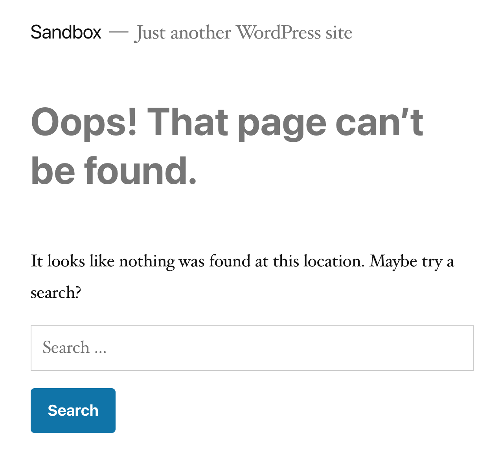
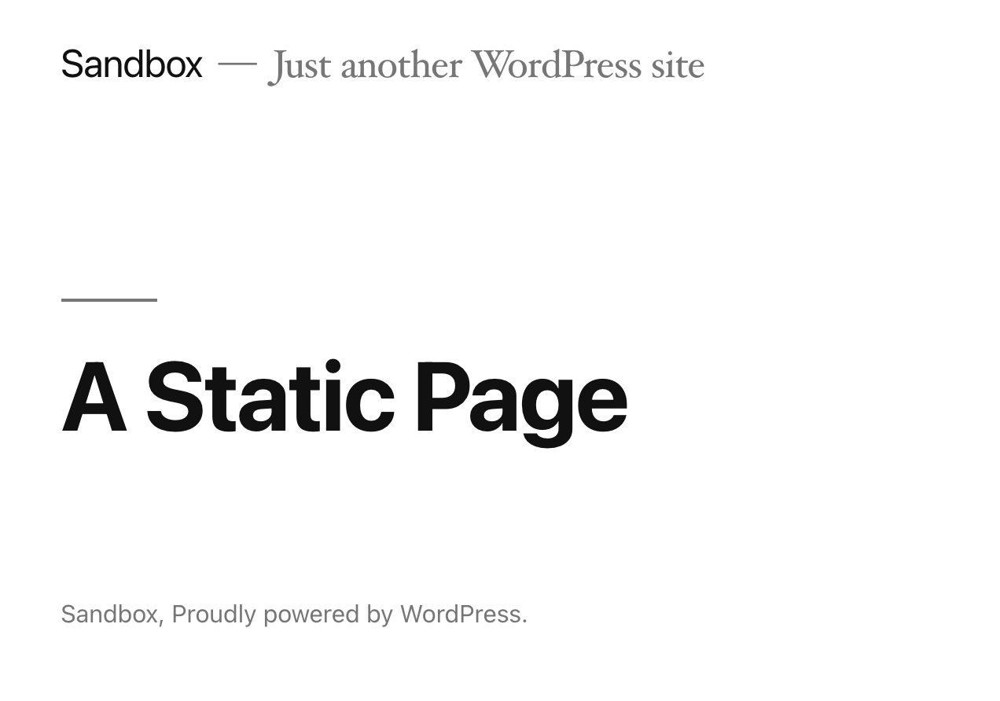

It's surprisingly a big pain to create a route and render a static template in WordPress *without* messing with the database. For example, let's say you'd like to create a static "/error" page, and there's no desire to have any of the content editable. You just want a particular template to render at that route every time.

If you give this sort of thing a Google search, you'll find a lot of results on setting up a [“static” front page](https://wordpress.org/support/article/creating-a-static-front-page/) (requiring a setting to be toggled in the WP admin), or using `page-*.php` [templates for specific pages](https://developer.wordpress.org/themes/template-files-section/page-template-files/), which also require the pages to first exist in the database. 

**But what if you want to create and render content for a route entirely in PHP — 100% programmatically?** It’s not straightforward (WordPress simply doesn’t lend itself best to registering routes in this way), but it’s not as complicated as you might think.

## Programmatically Registering a Route

For this breakdown, we’re going to register a route at `/a-static-page` , and have it render `YOUR_THEME_DIRECTORY/static-templates/a-static-template.php`. If I navigate to that page on my local “sandbox” instance of WordPress (I’m using the [twentynineteen](https://wordpress.org/themes/twentynineteen/) theme, by the way), I’ll expectedly get a 404: 



In order to pull this off, we’ll rely on three distinct WordPress hooks. At the most basic level, these can all be placed in a theme’s `functions.php` file.

### Create a Rewrite Rule

First, let’s create a rewrite rule that’ll attempt to match against a particular request path, and then *rewrite* that path into one that WordPress will use to parse and render a page. Let’s start with this:

```php
add_action('init', function () {
    add_rewrite_rule('a-static-page/?$', 'index.php?static_template=a-static-template', 'top');

	// Not required. Just here for easier local development.
	flush_rewrite_rules();
});
```

When a request comes in with a path that resembles “/a-static-page,” we’re rewriting the path to include a `static_template` query variable, whose value is the particular page template we want to render — `a-static-template.php`. Right now, however, **that new query variable is useless**. It’ll get filtered out as the request is parsed later on, unless we deliberate whitelist it. 

### Whitelist the Custom Query Var

To do that, we’ll use [the `query_var` filter](https://developer.wordpress.org/reference/hooks/query_vars/), which will permit our `static_template` variable to be accessible when we choose to render a custom template (or not).

```php
add_filter('query_vars', function($queryVars) {
    $queryVars[] = 'static_template';

    return $queryVars;
));
```

There isn’t much to this piece. The `query_vars` filter provides us the permitted query variables. We’re just tacking a custom one on the end. With that in place, we’re able to use the variable to maybe render a particular template.

### Conditionally Render a Template

From here on out, it's just a matter of setting up some logic. We'll check for our query variable. If it's set, return the respective page template. If it's not, return whatever template would've been rendered to begin with.

```php
add_action('template_include', function($template) {
    $staticQueryVarValue = get_query_var('static_template');

    if(!empty($staticQueryVarValue)) {
        return get_stylesheet_directory() . "/static-templates/{$staticQueryVarValue}.php";
    }

    return $template;
});
```

If you refresh that page now, you’ll should see the content within `a-static-template.php` :



## Not So Bad, Right?

Obviously, this is a pretty contrived example. In a real-life case, there may be a bit more complicated logic to wade through, and you could also clean this up a bit, like always naming the custom templates after the static paths you’re registering. Whatever the case, this should provide enough of a foundation to get you moving in the right direction a little faster.
