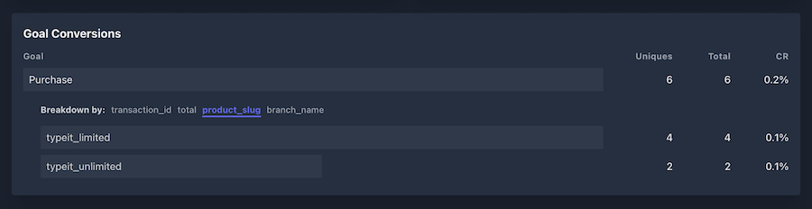
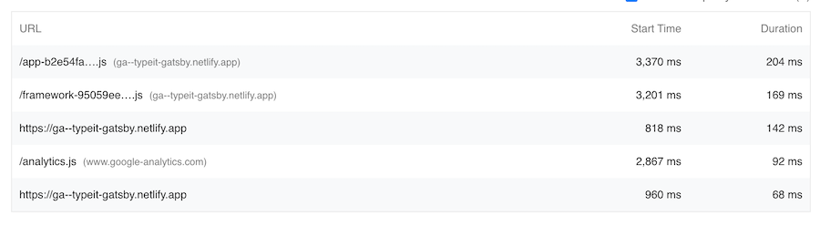
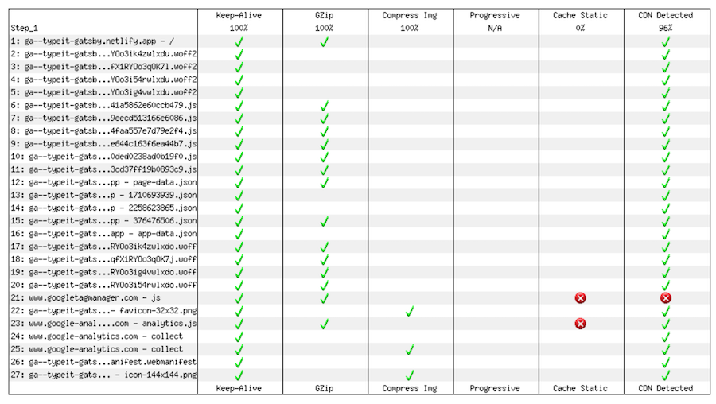

A while ago, I was hanging out with some guys at my buddy Buddy's (this is actually his first name) house. We were chatting about typical nerd stuff, when Samuel brought up a self-hostable, privacy-minded analytics service he's been using: [Plausible](https://plausible.io). I had never heard of it, but he gave a solid pitch, so I said I'd look into it. 

I didn't say that just to be polite — I had been on the hunt for an alternative to Google Analytics for some time. I've used it for years, but as time has gone on, there's been increasing pressure to "de-Google" in this way for a few reasons: 

* I've always felt overwhelmed by the UI and feature set. Way too much for my needs.
* The recommended installation approach has caused it to consistently show up in Lighthouse performance reports as problematic.
* It's a "free" product that owns all of the data I send through it, and you know what that means.

I decided to try out the self-hosted version of Plausible, which I put up via Docker Compose on a $5 DigitalOcean droplet. The whole process took ~20 minutes. I don't think I was ready for how easy and satisfying it was getting it stood up and seeing it in action. 

Looking back, here are the key things I've loved about the experience: 

### 1. It has thorough documentation.

For being as "small" as it is in the analytics space, I was very pleased by how thorough and SEO-friendly Plausible's documentation is. For the most part, when I needed something, I did a quick Google search with a few keywords, and the first result was *exactly* what I needed, right in their documentation. 

They appear to do a great job at anticipating the questions and concerns of their users, and solid documentation is the result of that. But some of the credit for this might also be due to the fact that the all of [the documentation is available on GitHub](https://github.com/plausible/docs), open to pull requests, and updated regularly. 

This all was a refreshing change from using Google Analytics. When searching for somethig for that tool, I'd often find several different sources that roughly relate to what I'm searching for, often scattered throughout Google's own resources. I'm sure there are reasons for that (wider feature scope, multiple implementation approaches, maturity & complexity of the product, etc.), but it became a pretty significant point of friction for me, especially when all I wanted to do was get something up & tracking. 

### 2. Its custom event handling is intuitive.

For my purposes, I don’t need any sort of complex event or user action analytics. I have (and probably will for quite some time) pretty simple things I’d like to keep track of: 

* License purchases for [TypeIt](https://typeitjs.com)
* Signups for [JamComments](https://jamcomments.com)
* [TypeIt documentation](http://typeitjs.com/docs) search queries
* Usage of TypeIt’s [interactive demo](https://www.typeitjs.com/build-your-own/)
* Something else I’m probably forgetting

And some of those events have custom data I’d like to attach to each event (ex: the license type someone purchased, or a search query).

In GA, it _seems_ relatively straightforward to send an event, which varies based on the implementation you’re using ([Global Site Tag](https://developers.google.com/analytics/devguides/collection/gtagjs/events) vs. [“standard”](https://developers.google.com/analytics/devguides/collection/analyticsjs/events)) — I just need to specify an event action, category, label, and value. But in reality, it was a little more complicated to implement. Among my issues:

* With so much documentation for each implementation, it’s easy to get peeved and feel somewhat lost.
* If I wanted to send custom data that’s not numeric, I couldn’t use the `value` field. Instead, I’d need to set up [custom dimensions](https://developers.google.com/analytics/devguides/collection/analyticsjs/custom-dims-mets), which, paired with “metrics, ” is an entirely different concept to wrap my head around.
* Finding custom event data within the GA admin is a pain. In fact, I never did figure out how to find data I had started to send w/ custom dimensions & metrics. I quickly grew impatient and confused, largely because it was so difficult to verify that I had even configured everything correctly.

Primed with this less-than-pleasant experience, Plausible’s custom event API was a godsend. After installing the core Plausible script, it was as simple as setting up the global `window.plausible` variable: 

```jsx
<script>window.plausible = window.plausible || function() { (window.plausible.q = window.plausible.q || []).push(arguments) }</script>
```

... and then sending an event:

```jsx
window.plausible('Sign Up');
```

Or, with custom data that pertains certain events. 

```jsx
window.plausible('Purchase', {	
  // Optional custom data.	
  props: {		
    product_slug: 'my-product-slug', 		
    total: 44	
  }, 		

  // Optional callback method fired after event is sent. 	
  callback: () => {		
    console.log('it sent!');		
  }
});
```

After setting up a goal in the Plausible admin, all that data appears in highly-digestible way. Here’s an example of how my “Purchase” event looked at one point: 



Good enough for me. And if I need to created some more complex reports with that data, it’s a matter of [accessing the database](https://plausible.io/docs/self-hosting-configuration#database) and running with it.

### 3. It’s more performant.

When I moved from Google Analytics to Plausible on [TypeIt’s site](https://typeitjs.com), [I tweeted](https://twitter.com/amacarthur/status/1464833420593438725) about my Lighthouse score improving by eight points. It’s a Gatsby site with a lot of JavaScript in play, and Lighthouse doesn’t report on the actual user experience, but even so, it was a little jarring. 

Some of the reason for this boost was pretty apparent. According Plausible, [its script is many times smaller than Google’s](https://plausible.io/vs-google-analytics#increasing-the-page-weight-and-the-loading-time), and that means less time downloading & parsing code. But according to Lighthouse and WebPageTest reports, other factors were due credit as well. 

One of those other factors was the amount of work Google Analytics performs on the main thread, choking out any other processes that may actually support the user’s experience. Here’s a shot of the problem scripts on [typeitjs.com](http://typeitjs.com). GA comes in at the third most thread-obnoxious script (divert your eyes from the top two... remember, this is a Gatsby site).



The other notable factor was the caching policy used by Google to serve its scripts. WebPageTest wasn’t happy about it:



These concerns don’t magically go away by moving from GA to another provider, but the lightweight and self-hosted nature of Plausible sure makes it easier to mitigate them. Addressing the first concern is automatic, and the second is solved by setting the appropriate caching headers when the script is served from my DigitalOcean droplet. 

### 4. SPA page tracking is easier.

This is a small perk I didn’t at all expect to see by moving to Plausible, but it’s an appreciated one. By default, Google Analytics collects its data only by executing after a page is loaded. As such, observing a user’s flow through several different pieces is achieved by stitching together the data from subsequent full page loads. 

It’s a fine way to go about it, but also makes it a bit of a hassle to track views in single page applications. In SPAs, there’s often a *single* page load, after which navigation is handled entirely client-side. They do a good job equipping people to accurately track page views in SPAs by providing [good documentation](https://developers.google.com/analytics/devguides/collection/analyticsjs/single-page-applications) on it. The short of it is that you need to manually send a `pageview` event whenever client-side navigation occurs. 

For my own NextJS site using the recommended [Global Site Tag](https://support.google.com/analytics/answer/9355662?hl=en) approach, I had to pull that off by listening for a `routeChangeComplete` event, which looked something like this (stripped down and a little contrived for simplicity):

```jsx
const pageView = function (url) {
  gtag("config", GA_TRACKING_ID, {
    page_path: url,
  });
};

export default function App({ Component, pageProps }) {
  const router = useRouter();

	// Track each client-side page navigation.
  useEffect(() => {
    const handleRouteChange = (url) => pageView(url);

    router.events.on("routeChangeComplete", handleRouteChange);

    return () => {
      router.events.off("routeChangeComplete", handleRouteChange);
    };
  }, [router.events]);

	// Track the initial page load.
  useEffect(() => {
    pageView(window.location.pathname);
  }, []);

  return <Component {...pageProps} />;
}
```

It’s nothing terribly complicated, but it’s also something I’d rather not have to worry about myself. 

Thankfully, Plausible takes care of this automatically by piggy-backing on client-side routers’ usage of the History API. In order to simulate page views performed in the context of an SPA, libraries like [react-router](https://reactrouter.com) will use `history.pushState()` to place these views into a user’s browser history. Plausible leverages that integration, meaning [I don’t have to do *anything*](https://plausible.io/docs/spa-support) to correctly track SPA page views after installing the script ([unless I want to](https://plausible.io/docs/script-extensions#plausiblemanualjs)). It just works!

### 5. My data belongs to me.

Google Analytics is mature and feature-rich service, but there’s a reason it’s free — all that data it collects [is used in a wide variety of ways](https://policies.google.com/technologies/partner-sites?hl=en-US) to benefit the business. I don’t have any particular issue with that model in and of itself, but the scope of its implications also doesn’t sit great with me. 

Among Plausible’s selling points, however, are its intentional focuses on privacy and data ownership. [Its website](https://plausible.io/privacy-focused-web-analytics) lists a wealth of ways they lean into that — things like no cookies, no cross-site tracking, no sharing data with any third party, and being able to self-host the entire thing. 

And that also means it’s easy to get my data *out* of Plausible too, like with its [Stats API](https://plausible.io/docs/stats-api), which I use to display analytics data on my [personal dashboard](https://macarthur.me/dashboard). One nice thing about self-hosting the tool is that there are virtually no limits to how much of my own data I can request on demand from my droplet. There’s an hourly limit, but even that can be manually increased by accessing the container, logging into the database, and updating a value: 

```jsx
-- Log into the database.
psql -U postgres -d plausible_db

-- Update every limit to 10000.
UPDATE api_keys SET hourly_request_limit = 10000
```

That leaves me feeling like my data really is easily accessible, safe, and _mine_. 

## 6. The data’s more reliable.

Ad blockers and privacy-focused browsers (like Brave) are a growing problem for the client-side analytics space. When using either, it’s increasingly common for Google Analytics requests to be blocked by default, impacting the accuracy of your data. 

One approach to address this is proxying analytics requests through your domain, which convinces privacy tools to consider the requests to be trustworthy. 

Wiring this up with Google Analytics is possible, but is neither simple nor maintainable in the long term. It requires serving the analytics script locally (by either proxying it from Google or maintaining a modified copy yourself), and then passing every event request through your domain as well. Modern tooling like serverless functions make it less of a hassle, but even so, it’s tedious and potentially unreliable if/when Google ever pushes updates to the script. 

It’d be remiss of me not to mention the strides Google Analytics is taking to help tackle some of these issues, such as the introduction of [server-side tagging](https://developers.google.com/tag-platform/tag-manager/server-side). But the amount of time and technical overhead required to take advantage of it is still more than I’m willing to take on for my side projects. 

Plausible, on the other hand, has [dedicated documentation](https://plausible.io/docs/proxy/introduction) on how to proxy its script through your own domain, covering a host of platforms, including two I use a lot — Netlify and Vercel. For the [current iteration of my blog](https://github.com/alexmacarthur/macarthur-me-next) — on Next.js — that’s as simple as setting up a couple of rewrites:

```jsx
// next.config.js 

module.exports = {
  async rewrites() {
    return [
      {
        source: "/js/numbers.js",
        destination: "https://analytics.macarthur.me/js/plausible.js",
      },
      {
        source: "/api/event",
        destination: "https://analytics.macarthur.me/api/event",
      },
    ];
  },
};
```

And then installing the script using my proxied destination: 

```html
<!-- The `<head>` of each page -->

<script defer data-domain="macarthur.me" src="/js/numbers.js"></script>
```

With those pieces in place, I’m able to successfully reach my analytics server without issue — even using privacy-focused browsers like Brave.

## Boring is Better

Plausible is a great example of how attractive and valuable products *without* a lot of features can be. I’m giving up a large set of tricks and functionality by dumping Google Analytics. But between the simplicity, performance, privacy gains, and everything else in between, the tradeoff has been more than worth it for me. And it’s helped get me one step closer to weaning myself off big tech as much as I reasonably can.

We'll see how things play out in the long term, but for the time being, I have no regrets.
